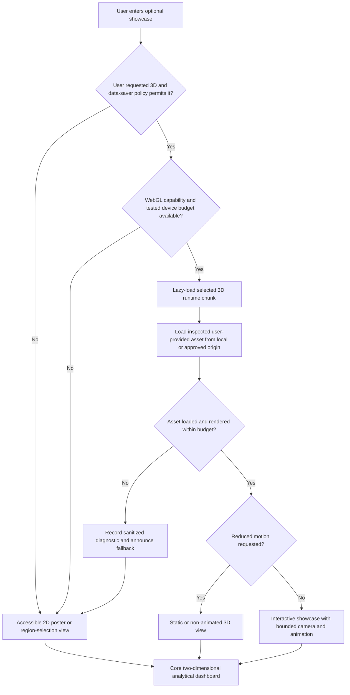

# User-provided 3D asset integration specification

**Status:** Accepted planning constraint; runtime decision deferred  
**Last updated:** 2026-08-02  
**Asset status:** Files have not been supplied or inspected. Compatibility cannot be confirmed from the current repository.

## 1. Role in SPARC

The user-provided Earth and satellite models are an optional **showcase experience** or landing/region-selection transition. They are not the primary innovation and are not dependencies of district analytics, map layers, indicators, provenance, confidence, or offline recovery.

The approved neutral placeholders are:

```text
assets/models/earth/[USER_PROVIDED_EARTH_MODEL]
assets/models/satellite/[USER_PROVIDED_SATELLITE_MODEL]
```

SPARC will not search for, purchase, download, generate, or substitute external Earth or satellite models.

## 2. Facts, assumptions, and unresolved questions

### Confirmed

- The team will later provide one Earth model and one satellite model.
- The analytical dashboard must work without either model.
- No runtime library has been selected.

### Unconfirmed until inspection

- File format and format version.
- License/ownership evidence and permission to redistribute in a public demo.
- Units, axis orientation, origin, scale, georeferencing and coordinate system.
- Mesh/poly/vertex counts, draw calls and material count.
- Texture formats, dimensions, color space, compression and external-file references.
- Rigging, animation clips, morph targets and intended playback.
- Lighting/material expectations and transparency.
- Compressed and decoded size, GPU memory cost and target-device performance.
- Whether either file is compatible with CesiumJS, Three.js, React Three Fiber, Babylon.js, or another runtime.

No implementation estimate should treat these unknowns as resolved.

## 3. Stage-gated decision process

| Gate | Required evidence | Pass condition | Failure action |
|---|---|---|---|
| 1. Custody and license | Owner statement, source file, redistribution terms | Team has documented right to use and publish the supplied asset | Keep asset private or omit it; do not seek a replacement |
| 2. Format identification | File extension plus parser/validator result | Actual format/version and all dependent files are known | Ask user for a supported export or defer 3D |
| 3. Structural inventory | Mesh, material, texture, animation, axis/unit and bounds report | Scene is finite, references resolve, and transform is understood | Repair/export only with user approval; otherwise static fallback |
| 4. Runtime spike | Minimal isolated loader in a throwaway implementation branch | Asset loads correctly on agreed desktop/mobile test matrix | Evaluate a different runtime only if format evidence supports it; otherwise omit |
| 5. Performance gate | Transfer, parse, texture-memory, frame-time and accessibility results | Meets the approved showcase budget without affecting core dashboard | Optimize with user-approved conversion, reduce experience, or use 2D fallback |
| 6. Release gate | Offline, WebGL-loss, reduced-motion and error tests | Every failure reaches a usable non-3D experience | 3D stays disabled for release |

Conversion is a modification to a user-provided asset and requires explicit approval, documented tool/version/settings, preservation of the original file, and a new derived-asset checksum.

## 4. Candidate format inspection matrix

These are formats to verify, not claims about the supplied files.

| Candidate | Inspection focus | Potential implication, subject to runtime test |
|---|---|---|
| GLB | Embedded buffers/textures, extensions, animation, compression | Self-contained delivery may simplify packaging; unsupported extensions or large embedded textures may still fail |
| glTF | External URI references, directory structure, extensions, texture paths | Every referenced file must remain available under local HTTP and in the offline manifest |
| FBX | Binary/ASCII variant, axis/units, materials, animation and exporter version | Browser delivery commonly requires a loader or conversion, but no path is selected before inspection |
| OBJ | MTL/texture references, scale, normals, material count and no assumed animation | Simple geometry can still have large files, broken references or inefficient draw calls |
| Other | Exact specification, parser availability, license and conversion path | Treat as unsupported until a bounded compatibility spike succeeds |

## 5. Loading and fallback flow



The reduced-motion branch suppresses continuous orbit, parallax, auto-rotation and non-essential transitions. A successfully loaded reduced-motion session reaches `StillScene`, not a background animation.

## 6. Scene behavior specification

### Camera

- Start from a deterministic framing based on inspected model bounds, not hard-coded assumed units.
- Clamp near/far planes, zoom and orbit to prevent clipping, loss of the model, or disorientation.
- Do not hijack page scroll or keyboard navigation.
- Provide a visible reset control and a direct “Skip to dashboard” control.
- Region selection may trigger a short transition only when motion is permitted; it cannot be the sole means of selecting a region.

### Lighting and materials

- Determine whether materials are physically based, unlit, emissive or custom during inspection.
- Use a minimal deterministic light/environment setup. Do not rely on a remote HDR environment.
- Verify texture color space, transparency, normal direction and exposure on supported browsers.
- Do not modify textures or materials without retaining the original and documenting user approval.

### Animation

- Inventory named clips, duration, loop intention and rig compatibility.
- Default to stopped when `prefers-reduced-motion: reduce` is active.
- Do not create scientifically suggestive orbital paths, locations, or real-time telemetry from a decorative asset.
- Animation failure degrades to a still model, then a 2D poster; it does not block navigation.

### Coordinate systems

- Inspect asset local axes, units, pivot/origin and handedness.
- A decorative Earth model is not automatically a geospatial globe. Do not map longitude/latitude to its surface until its coordinate transform and geometry are verified.
- A georeferenced Cesium/3D Tiles use case would be a separate decision from displaying a decorative GLB/glTF scene.

## 7. Performance budget

The following are **project acceptance targets**, not measured asset facts:

- Zero model bytes and zero 3D runtime bytes are required for the core dashboard route before the user enters/requests the showcase.
- 3D load failure, timeout or cancellation must leave the dashboard usable without a reload.
- Model and runtime assets must be served locally in the demo package; no remote runtime CDN or texture dependency.
- The inspection report must record compressed transfer size, decoded geometry size, texture-memory estimate, draw calls and frame timing on the agreed low-end mobile and presentation laptop.
- The provisional transfer ceilings from `NFR-PERF-004` are 10 MB compressed for the desktop showcase and 3 MB for the mobile path, including model payloads/textures required before first meaningful render. Inspection may set a stricter limit; raising either ceiling requires an explicit requirement/performance review. Frame-time and load-time ceilings must be approved after the actual files and presentation/mobile devices are measured. If the asset cannot meet the approved budget without unauthorized modification, the release uses the 2D fallback.
- Dispose of GPU resources and event listeners when leaving the showcase.

This avoids fabricating a size claim before the assets exist while still making non-blocking delivery measurable.

## 8. Accessibility and progressive enhancement

- The 3D canvas is supplementary. Provide a concise text description and equivalent district-selection controls outside it.
- All controls require visible labels, keyboard access, focus indication and screen-reader names.
- Do not encode analytical meaning only by motion, depth, hover, or color.
- Honor `prefers-reduced-motion`; provide a user-visible pause/stop when animation is present.
- Announce loading/failure state without repeatedly interrupting assistive technology.
- Preserve logical focus when the scene loads or falls back.
- WebGL unavailable, context lost, asset corrupt, mobile budget exceeded, or JavaScript disabled leads to the 2D experience.

## 9. Security and integrity

- Treat supplied binaries and metadata as untrusted until scanned/validated; record SHA-256 and byte size before and after any approved conversion.
- Resolve all external asset references against an allowlisted local asset root. Reject traversal, `data:` payload surprises and remote texture/URI references unless explicitly reviewed.
- Cap file, texture, vertex/material and animation complexity during validation to avoid browser memory exhaustion.
- Do not render unescaped asset names/metadata as HTML.
- Preserve proof of license/ownership separately from the distributable bundle.
- Never upload the models to third-party conversion or optimization services without explicit user authorization.

## 10. Ownership and acceptance

- User: supplies files and licensing/redistribution confirmation; approves any conversion.
- Claude/frontend owner: runs the isolated compatibility/performance spike and implements progressive UI after contract approval.
- Codex/architecture owner: reviews local-serving, integrity, security and offline-manifest implications.
- Shared: approves runtime, numeric performance budget and release enablement.

3D is accepted only when the actual files pass all stage gates, the two-dimensional dashboard remains complete, and the demo has a rehearsed 2D fallback. Otherwise it stays a documented placeholder.

## 11. Sources

Official standards were accessed on 2026-08-02.

- [glTF 2.0 Specification — Khronos Group](https://registry.khronos.org/glTF/specs/2.0/glTF-2.0.html). Format structure, coordinate conventions, buffers, images, materials, animations and extensions.
- [WebGL Specification — Khronos Group](https://registry.khronos.org/webgl/specs/latest/1.0/). Browser graphics context and context-loss behavior.
- [Media Queries Level 5: `prefers-reduced-motion` — W3C](https://www.w3.org/TR/mediaqueries-5/#prefers-reduced-motion). User motion-preference signal.
- [WCAG 2.2 — W3C, 2023-10-05](https://www.w3.org/TR/WCAG22/). Keyboard, motion, timing, text-alternative and perceivability requirements.
