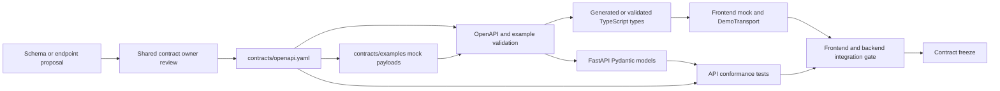

# SPARC API contract architecture

**Status:** Accepted contract-first design  
**Last updated:** 2026-08-02  
**Normative artifact:** `contracts/openapi.yaml`  
**Scope:** This document defines ownership and semantics; it does not implement route handlers.

## 1. Contract decision

SPARC uses one OpenAPI 3.1 contract for the browser, mock responses, demo assets, and planned FastAPI service. Operation-specific response schemas are authoritative. The frontend must not maintain independent handwritten copies of backend interfaces.

OpenAPI 3.1.2 is the current published 3.1 patch as of the access date. The documentation-phase `contracts/openapi.yaml` intentionally declares `3.1.0` for compatibility with the planned FastAPI/tooling path while retaining OpenAPI 3.1 semantics and JSON Schema 2020-12 references. That patch choice must pass the selected validator and generator compatibility check before contract freeze. No OpenAPI 3.0-only schema workaround may silently weaken a 3.1 contract.

## 2. Contract workflow



### Ownership rules

- Codex is primary editor for `contracts/openapi.yaml`, examples, and server conformance tests.
- Claude consumes reviewed types/examples and owns frontend adapters and UI states.
- Contract changes require both owners to review their impact.
- Generated files are never hand-edited. Their header and repository guidance must identify the generator command and source revision.
- Contract freeze occurs at the end of Day 0. Additive compatible changes may proceed with review; a breaking change requires an explicit version decision, regenerated artifacts, updated examples, and both clients updated before merge.

## 3. Protocol conventions

| Concern | Convention |
|---|---|
| Base path | `/api/v1` |
| Media type | `application/json` unless the layer descriptor points to an asset-specific type |
| Dates | ISO 8601 calendar dates, `YYYY-MM-DD` |
| Timestamps | RFC 3339 UTC with `Z` where generated by SPARC |
| Geometry | RFC 7946 GeoJSON in WGS 84 longitude/latitude order |
| Bounding box | `[west, south, east, north]` |
| Identifiers | Opaque stable strings; clients must not infer database keys or paths |
| Missing numeric result | JSON `null` plus a machine-readable reason; never `NaN` or `Infinity` |
| Errors | `application/problem+json` using RFC 9457 plus stable SPARC extensions |
| Async work | `202 Accepted` with `Location` and a job resource |
| Correlation | Client may send `X-Request-ID`; service returns a sanitized server request ID |
| Idempotency | `Idempotency-Key` for comparison/job creation in live mode |
| Versioning | Major contract version in path; semantic schema/data version in response metadata |

## 4. Common request headers

| Header | Required | Used by | Validation and behavior |
|---|---:|---|---|
| `Accept: application/json` | Recommended | All JSON endpoints | Unsupported response media types may return `406` |
| `Content-Type: application/json` | Required with a body | POST endpoints | Missing/wrong type returns `415` or a documented framework-equivalent problem |
| `Idempotency-Key` | Required when live job creation is enabled | `POST /comparisons`, restricted `POST /processing/jobs` | Bounded length/character set; same key with different canonical body returns `409` |
| `If-None-Match` | Optional | Immutable GET results and layer descriptors | Matching ETag returns `304` |
| `X-Request-ID` | Optional | All | Treat as untrusted; validate length/characters and never use as an authorization value |
| `Authorization` | Not required for public P0 read/demo routes | Future restricted processing route only | If enabled, server validates it; never expose provider credentials to clients |

Authentication is intentionally absent from public P0 reads. A future processing-creation endpoint must be disabled or protected rather than relying on obscurity.

## 5. Endpoint specification

The endpoint list is intentionally stable across live and demo-capable modes. Unsupported P1 operations must return an explicit capability/error response; they must not pretend to run.

### 5.1 Health and region discovery

| Field | `GET /api/v1/health` | `GET /api/v1/regions` | `GET /api/v1/regions/{regionId}` |
|---|---|---|---|
| Purpose | Cheap process liveness | List supported regions and capabilities | Read one district/block/subdistrict record |
| Called by | Deployment checks and browser startup | Region selector | Region header/drill-down |
| Inputs | No body | Optional `type` and `parentId` query values | Required opaque path ID |
| Authentication | None in P0 | None in P0 | None in P0 |
| Validation | No external dependency calls | Type enum and bounded opaque parent ID | ID length/character policy |
| Business/data calls | In-process build metadata only | Result repository/demo manifest | Result repository/demo manifest |
| Success | `200` with `status`, build version and `dataMode` | `200` region summaries and links | `200` region, parent/children, bbox/centroid and geometry link |
| Errors | `500` only for unhealthy process serialization; readiness is separate | `400/422`, `500/503` | `400/422`, `404`, `500/503` |
| Security concerns | Do not leak environment, paths, dependency URLs or secrets | Bound response size; do not expose unpublished geometry | Prevent path traversal by treating ID as data, never a filename |

### 5.2 Region summaries and indicators

| Field | `GET /api/v1/regions/{regionId}/summary` | `GET /api/v1/regions/{regionId}/indicators` | `GET /api/v1/regions/{regionId}/indicators/{indicatorId}` | `GET /api/v1/regions/{regionId}/timeseries` |
|---|---|---|---|---|
| Purpose | Dashboard-ready district summary | List available indicator results | Read one full indicator result | Read optional P1 temporal series |
| Called by | Dashboard landing view | Indicator navigation/cards | Comparison map/card/detail | Chart view |
| Inputs | Region ID plus required baseline/comparison date query values | Region ID; required baseline/comparison dates and optional indicator filter | Region and indicator IDs plus required baseline/comparison dates | Region ID, approved indicator ID and bounded start/end dates |
| Authentication | None in P0 | None in P0 | None in P0 | None in P0 |
| Validation | Region and period compatibility | IDs, ISO dates, `start <= end`, maximum span, same-season policy warning | IDs, supported method/version and period pair | IDs, date span and bounded result-point policy |
| Business/data calls | Result repository and interpretation templates | Result repository | Result/layer/provenance repository | Precomputed series repository; no synchronous scene processing |
| Success | `200` summary, quality, warnings and links | `200` indicator summaries | `200` metric, comparison, layers, quality, provenance and interpretation | `200` ordered points with quality per point |
| Errors | `404`, `422`, `502`, `503`, `500` | `404`, `422`, `503` | `404`, `422`, `502`, `503` | `404`, `422`, `502`, `503` when not available |
| Security concerns | Interpretation strings come from trusted templates | Bound item count | Layer URLs come only from opaque registry; sanitize citation URLs | Bound point count; do not expose provider tokens in source links |

### 5.3 Comparisons and jobs

| Field | `POST /api/v1/comparisons` | `GET /api/v1/comparisons/{comparisonId}` | `POST /api/v1/processing/jobs` | `GET /api/v1/processing/jobs/{jobId}` |
|---|---|---|---|---|
| Purpose | Resolve or request a canonical comparison | Read comparison result/status link | Optional restricted P1 creation of an approved processing recipe | Poll safe job state |
| Called by | Main comparison form | Browser after cache hit/job completion | Operator tooling, not normal P0 UI | Browser only after an operation returned `202` with the job location |
| Request body | `regionId`, `indicatorIds`, structured baseline/comparison periods and required `modePreference` enum | None | Approved `recipeId` plus region and period parameters; never a URL/command/path | None |
| Authentication | None for precomputed P0 lookup; server policy required before live compute | None in P0 | Required if enabled; otherwise endpoint disabled | None in the current draft; the opaque resource exposes safe status only and no request/provider secret |
| Validation | Known region/indicators, unique bounded list, valid equal-season periods, mode enum, body limit, idempotency | Opaque ID | Allowlisted recipe and values, quota and idempotency | Opaque ID |
| Business/data calls | Deterministic key lookup; optional job coordinator | Result/job repositories | Job coordinator only | Job repository |
| Success | `200` cache/demo hit or `202` with `Location` and job | `200` complete/partial result, or state/link | `202` job resource | `200` queued/running/complete/partial/failed/cancelled state |
| Errors | `400/422`, `404`, `409`, `429`, `502`, `503` | `404`, `410` expired, `500/503` | `401/403`, `404`, `409`, `422`, `429`, `500/503` | `404`, `410`, `500/503` |
| Security concerns | Rate/body limits; no arbitrary AOI or remote asset; no silent demo substitution | Access policy must not be inferred from ID secrecy | Prevent SSRF, command injection and resource exhaustion; strict authorization | Error details must not include traces, provider bodies, secrets or host paths |

`status: failed` is a valid representation of an existing job and therefore may be returned with HTTP `200`. HTTP errors describe failure to retrieve or operate on the resource.

### 5.4 Layers and metadata

| Field | `GET /api/v1/layers/{layerId}` | `GET /api/v1/layers/{layerId}/tilejson.json` | `GET /api/v1/metadata/datasets` | `GET /api/v1/metadata/indicators` |
|---|---|---|---|---|
| Purpose | Read provider-neutral layer descriptor | Read TileJSON-compatible descriptor for tiled layers | List source datasets/licenses/citations | List method definitions, formulas, versions and limitations |
| Called by | Map adapter | MapLibre source loader | Provenance UI | Indicator help/method UI |
| Inputs | Opaque layer ID | Opaque layer ID | No query inputs in the v1 draft | No query inputs in the v1 draft |
| Authentication | None for published P0 layers | None for published P0 layers | None | None |
| Validation | ID policy and publication state | Same plus representation must be tiled | None beyond response integrity | None beyond response integrity |
| Business/data calls | Layer registry | Layer registry/static descriptor | Metadata repository/demo payload | Metadata repository/demo payload |
| Success | `200` representation, bounds, legend, attribution, checksum and relative URL | `200` safe tile template, bounds, zooms and attribution | `200` dataset records | `200` indicator records |
| Errors | `404`, `410`, `500/503` | `404`, `409` not tileable, `410`, `503` | `500/503` | `500/503` |
| Security concerns | Never accept `?url=`; registry maps ID to allowlisted published object | Template must target approved same-origin/CDN base; cap zoom and tile size | Never emit credentials or transient signed asset URLs | Escape/sanitize any rendered rich text; formulas are curated data |

## 6. Core schemas

| Schema | Required meaning |
|---|---|
| `RegionRef` | `id`, `name`, `type`, nullable `parentId`, `bbox`, `centroid`, nullable relative `geometryUrl` and supported `indicatorIds` |
| `Period` | `startDate`, `endDate`, label, nullable season label, composite method and scene count |
| `IndicatorRef` | Stable ID/version, name, proxy label, unit and direction |
| `MetricValue` | Baseline, comparison, absolute/percent change and unit; unavailable values are nullable with a reason |
| `QualityAssessment` | Level (`high`, `medium`, `low`, or `unknown`), basis (`validated`, `heuristic`, or `unavailable`), method version, reasons, warnings and evidence |
| `QualityEvidence` | Common-valid, cloud, nodata and coverage percentages; baseline/comparison scene counts; threshold sensitivity; independent-validation flag and nullable user/producer accuracy |
| `Provenance` | Dataset/provider/mission/collection, Item IDs, acquisition times, asset keys, stable catalog link, citation/license, processing baseline, algorithm/parameter version, analysis CRS and generation time |
| `Interpretation` | Plain-language summary, caveats, suggested-actions array and trusted rule/template ID; no unsupported causation |
| `LayerDescriptor` | Opaque ID, layer/representation type, approved relative `href`/`tileJsonHref`, bounds, zooms, opacity, legend, attributions, checksum/content version and offline availability |
| `Job` | ID, state, bounded progress, timestamps, expiry, result links and sanitized errors |
| `ProblemDetails` | RFC 9457 fields plus stable `code`, `traceId` and `invalidParams` array |

### Common response envelope

```json
{
  "data": {},
  "meta": {
    "schemaVersion": "1.0.0",
    "requestId": "opaque-request-id",
    "generatedAt": "2026-08-02T00:00:00Z",
    "dataMode": "demo",
    "partial": false,
    "mock": true,
    "warnings": []
  },
  "links": {
    "self": "/api/v1/example",
    "related": []
  }
}
```

This is a structural example, not a real project result. `data` remains operation-specific rather than becoming an unbounded polymorphic object. `dataMode` is one of `live`, `cache`, or `demo`.

## 7. HTTP status semantics

| Status | Meaning in SPARC |
|---:|---|
| `200 OK` | A requested representation exists, including a job whose represented state is failed |
| `202 Accepted` | Valid work was queued; response includes `Location` and job representation |
| `304 Not Modified` | Client ETag matches an immutable GET resource |
| `400 Bad Request` | Malformed request syntax or mutually contradictory parameters |
| `401 Unauthorized` | A protected operation lacks valid authentication |
| `403 Forbidden` | Caller is authenticated but not permitted to run the operation |
| `404 Not Found` | Opaque resource ID does not exist or is not published |
| `409 Conflict` | Request conflicts with resource state or an idempotency key was reused with different content |
| `410 Gone` | A documented temporary job/result expired |
| `415 Unsupported Media Type` | Request body is not an accepted media type |
| `422 Unprocessable Content` | JSON is syntactically valid but fails field/domain validation |
| `429 Too Many Requests` | Caller/provider budget is exhausted; include safe retry guidance where known |
| `500 Internal Server Error` | Unexpected server failure; return no raw exception |
| `502 Bad Gateway` | An upstream provider returned an invalid/failed response |
| `503 Service Unavailable` | Required live capability is temporarily unavailable; may include `Retry-After` |

A scientifically usable incomplete result returns `200` with `meta.partial: true`, explicit missing fields and warnings. HTTP `206` is not used as a general scientific-partial flag because it has representation/range semantics.

## 8. Validation and failure behavior

### Accepted input types

- IDs: required opaque strings with a bounded length and conservative character policy.
- Indicator arrays: required for comparison creation, unique, non-empty and capped.
- Periods: required objects with valid dates, `startDate <= endDate`, bounded duration and comparable seasons.
- Geometry: P0 accepts approved region IDs; it does not accept arbitrary uploaded GeoJSON.
- Mode preference: required enum (`auto`, `demo`, or `live`). A preference is not permission to start costly work.

Browser validation improves feedback but is never authoritative. FastAPI/Pydantic repeats structural checks, and business services enforce region capability, period comparability, resource/quota, and publication rules.

### Dependency failure

- Repository unavailable: `503`, unless a verified cached result can be returned with `dataMode: cache`.
- Provider failure during a job: job becomes `partial` or `failed` with a stable safe code; raw upstream content is retained only in protected server logs subject to redaction.
- Missing demo asset: DemoTransport returns a typed integrity/missing-data state and offers the supported primary/backup scenarios.
- Invalid payload generated by backend/demo build: contract tests fail the build; the client must not guess field meanings.

## 9. Caching and immutability

- Immutable content-addressed results and demo assets use ETags and may use long-lived `public, immutable` caching after review.
- Mutable job resources use `no-store` or revalidation; they are never immutable-cached.
- Canonical query/body values and algorithm/geometry versions form the cache key.
- Changing a method, source item, mask, period, CRS or boundary version creates a new result identity.
- Authenticated or future user-specific content must never enter a shared public cache.

## 10. Security requirements

1. No provider secret in browser code, `VITE_*` values, demo payloads, logs or API responses.
2. CORS allowlists the deployed browser origin; local development origins are explicit, not wildcarded with credentials.
3. Layer resolution accepts an opaque ID only. It cannot fetch a client-supplied URL, preventing an open proxy/SSRF class of failure.
4. Server outbound access is allowlisted to approved catalog/object hosts and protocols.
5. Body, date-range, list, geometry, zoom, tile-size, job and response limits are enforced.
6. All displayed external metadata is escaped; curated Markdown/HTML, if later allowed, is sanitized.
7. Problem responses and health checks reveal no filesystem paths, environment values, stack traces, tokens, signed URLs or internal hostnames.
8. Provenance records store stable catalog identity and asset keys, not expiring signed access URLs.

## 11. Contract acceptance gates

- The OpenAPI document parses and validates with the selected 3.1-aware validator.
- Every operation identifies its success and applicable validation/problem statuses and schemas; the required representative success/partial/job/error states have clearly marked mock payloads under `contracts/examples/`.
- All committed example payloads validate against their intended canonical schemas.
- Frontend mock/demo adapters pass the same schema fixtures as the planned API.
- FastAPI's emitted/served OpenAPI is diff-checked against the reviewed contract or generated from the same source without undocumented changes.
- Breaking-change tests cover removed fields, narrower enums, changed required fields and altered meanings.
- Contract freeze is signed off before Day 1 independent implementation begins.

## 12. Sources

Official standards and documentation were accessed on 2026-08-02.

- [OpenAPI Specification 3.1.2 — OpenAPI Initiative, 2025-09-19](https://spec.openapis.org/oas/v3.1.2.html). Current OpenAPI 3.1 patch and versioning rules.
- [RFC 9457: Problem Details for HTTP APIs — IETF, July 2023](https://www.rfc-editor.org/rfc/rfc9457). Standard error representation.
- [RFC 9110: HTTP Semantics — IETF, June 2022](https://www.rfc-editor.org/rfc/rfc9110). HTTP methods, status codes and caching semantics.
- [RFC 7946: The GeoJSON Format — IETF, August 2016](https://www.rfc-editor.org/rfc/rfc7946). Geometry and coordinate exchange rules.
- [FastAPI request body documentation — FastAPI project](https://fastapi.tiangolo.com/tutorial/body/). Pydantic parsing, validation and generated schema behavior.
- [STAC API specification 1.0.0 — STAC community](https://api.stacspec.org/v1.0.0/core/). Search/catalog API conventions; Apache-2.0 licensed specification.
