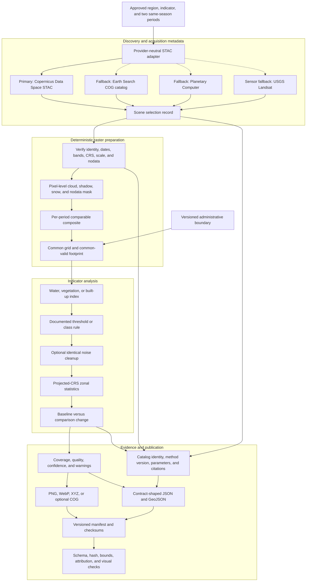
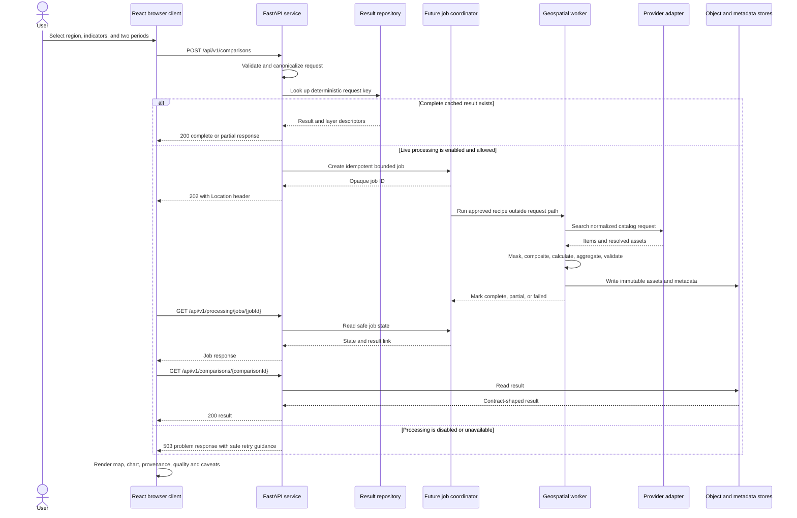
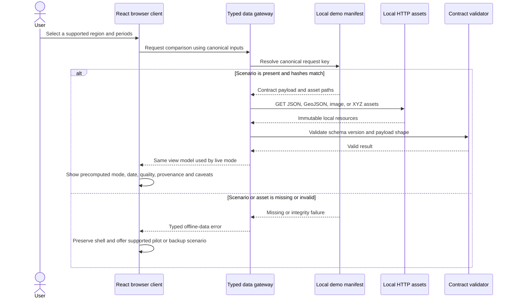

# SPARC data pipeline

**Status:** Accepted for prototype planning  
**Last updated:** 2026-08-02  
**Primary objective:** Produce deterministic, same-season, provenance-rich district and block/subdistrict proxy indicators while keeping the demo independent of external services.

## 1. Pipeline decision

P0 processing is an offline, repeatable build step. The planned API reads its outputs; it does not calculate full raster products during an HTTP request. Live mode later reuses the same pipeline behind a bounded job interface.

The pipeline produces environmental **proxy indicators**, not official UN SDG measurements and not proof of causation.

## 2. End-to-end data flow

Dotted provider arrows are fallbacks, not parallel requirements.

## 3. Stage contracts

| Stage | Required inputs | Required output/evidence | Reject or warn when |
|---|---|---|---|
| Region resolution | Stable region ID and versioned district/block geometry | Geometry checksum, source, license, CRS and validity report | Geometry is invalid, unlicensed, missing, or changes without a version |
| Scene discovery | Region bbox, period, collection and quality search filters | Provider, STAC endpoint, collection, item IDs, timestamps and asset keys | No candidate coverage or provider response is incomplete |
| Scene selection | Candidate Items and documented selection policy | Immutable scene-selection record and exclusion reasons | Periods use unequal/irrelevant seasons or insufficient clear observations |
| Asset read | Stable Item identity and logical band mapping | Verified band, scale/offset, CRS, transform, nodata and checksum where available | Asset mapping is ambiguous or a transient signed URL is treated as identity |
| Pixel QA | Sensor/product-specific quality fields | Valid mask and per-period valid-observation counts | Only collection-level cloud percentage is used as a pixel mask |
| Composite | Masked observations and documented statistic | Comparable baseline and comparison composites | Methods, grid, masks or windows differ between periods |
| Indicator | Composite bands and versioned method parameters | Index/mask raster and method record | Denominator produces non-finite values or unsupported threshold is hidden |
| Zonal statistics | Valid aligned raster and boundary | Area/percentage/central statistic using projected metre-based analysis | Area is computed directly in longitude/latitude degrees |
| Quality/confidence | Coverage, scene count, mask and method sensitivity | Evidence fields, categorical confidence and warnings | A confidence label is presented as measured accuracy without validation |
| Publication | Metrics, layers, provenance and contract version | Immutable payloads, layer assets, manifest and checksums | Any example fails schema, attribution, URL, bounds or visual checks |

## 4. Provider abstraction

Every provider adapter must supply the following normalized information:

| Field | Purpose |
|---|---|
| `providerId` | Stable source identifier such as `cdse` or `earth-search` |
| `stacRoot` | Catalog root used for discovery |
| `collectionMap` | SPARC logical product to provider collection mapping |
| `assetMap` | Logical band/QA name to provider asset-key mapping |
| `authStrategy` | `none`, OAuth, object credentials, or signing hook; server-side only |
| `licenseResolver` | Dataset license, citation and attribution extraction |
| `itemNormalizer` | Normalizes provider extensions without discarding original metadata |
| `assetResolver` | Produces an access URL at runtime without using it as permanent provenance |

An `assetResolver` URL is untrusted input. The acquisition process validates and downloads it into quarantine; Rasterio/GDAL receive only an approved local path. Driver restriction, resource limits, process isolation, and publication rules are mandatory in [pipeline hardening](pipeline-hardening.md).

Google Earth Engine `COPERNICUS/S2_SR_HARMONIZED` is the primary offline Sentinel-2 processing source. Direct CDSE STAC is retained as a fallback discovery path; Earth Search and Planetary Computer remain recovery options only after a compatibility check. USGS Landsat remains a separately versioned P1 sensor path. Earth Engine credentials are worker-only and never part of the released demo.

The Bhuvan portal must not be treated as generally open for derivative processing or bulk redistribution. Only a specifically identified dataset with verified permission may enter the pipeline.

## 5. Live or semi-live request sequence

### Live constraints

- A comparison request uses region IDs and approved indicator IDs, not caller-supplied object URLs, SQL, filesystem paths or arbitrary AOIs in P0.
- The service may return a cached result synchronously; expensive processing must not block the request worker.
- Retries are bounded and jittered. A provider failure must become a typed job/error state, not an indefinitely loading screen.
- The UI may offer demo mode after connectivity or service-unavailable failure, but must disclose the switch and must not fall back on validation, authorization, or data-integrity errors.

## 6. Precomputed demo sequence

## 7. Determinism and identifiers

A result request key must be derived from canonical values, at minimum:

- region geometry ID and version;
- indicator ID and method version;
- baseline and comparison date windows;
- sensor/product collection;
- scene-selection policy version;
- cloud/quality-mask version;
- composite method;
- threshold/classification parameters;
- target grid and analysis CRS;
- cleanup rule; and
- software/environment manifest version.

The key may be hashed for filenames and cache lookup. A human-readable `comparisonId` remains opaque to the client. Changing a scientific input creates a new immutable result; it must not overwrite a previous result in place.

## 8. Spatial and temporal rules

- Exchange geometries follow RFC 7946 GeoJSON: WGS 84 coordinates in longitude, latitude order.
- Pixel area and zonal area use a documented projected or equal-area CRS suitable for the selected region, not EPSG:4326 degrees.
- Both periods use equal-length, same-calendar-season windows unless a method document provides a stronger matched design.
- Metrics use only the common valid footprint, or disclose and quantify any alternative. Cloud/no-data pixels are unknown, not automatically land.
- Layer display resampling must not be confused with the source sensor's effective resolution.
- No result may claim that an observed spatial or temporal association caused an environmental outcome.

## 9. Output set

Each P0 comparison pack must contain:

1. Contract-shaped district summary and per-indicator JSON.
2. At least one block/subdistrict result if licensed, suitable boundaries are available.
3. Versioned boundary GeoJSON or a layer descriptor pointing to it.
4. Before and after image/raster presentation assets and a change layer when applicable.
5. Legend, unit, scale/resolution and bounds.
6. Quality and common-valid-coverage evidence.
7. Plain-language interpretation explicitly labeled as a proxy.
8. Provenance with dataset identity, dates, item IDs, method version, parameters, analysis CRS, citations and generation time.
9. Manifest entries with media type, byte size and cryptographic hash.
10. A validation record for schemas, URLs, hashes, bounds, attribution and visual inspection.

## 10. Failure ladder

| Failure | Primary response | Secondary response | Demo-safe response |
|---|---|---|---|
| CDSE discovery unavailable | Bounded retry | Earth Search or Planetary Computer adapter | Use precomputed pack |
| Sentinel asset unavailable | Alternate authorized provider copy | USGS Landsat with a separate method/version | Use precomputed Sentinel-derived pack |
| Cloud-heavy window | Expand within documented same-season limits | Use radar/reference corroboration where methodology permits | Use selected backup region/period |
| Boundary failure | Verify alternate authoritative/licensed boundary source | District-only scope | Use bundled versioned boundary |
| Processing/ABI failure | Rebuild the pinned container | Use last validated output | Use checksum-verified pack |
| Dynamic tile failure | Serve cached/prebuilt tiles | Serve bounded image overlay | Use static image and text/table |
| Partial coverage | Return usable result with `partial: true` and warnings | Select alternate period | Show backed-up scenario |

## 11. Sources

Official sources were accessed on 2026-08-02.

- [Copernicus Data Space STAC — European Commission](https://documentation.dataspace.copernicus.eu/APIs/STAC.html). Current STAC endpoint, supported specification and Sentinel collections.
- [STAC specification overview — STAC community](https://stacspec.org/en/about/stac-spec/). Catalog, Collection, Item and API model.
- [OGC Cloud Optimized GeoTIFF Standard 1.0 — Open Geospatial Consortium](https://docs.ogc.org/is/21-026/21-026.html). Tiled/overview structure and HTTP range-readable access model.
- [Earth Search repository — Element 84](https://github.com/Element84/earth-search). Service implementation and explicit absence of a service-level guarantee.
- [Sentinel-2 L2A COGs — Registry of Open Data on AWS](https://registry.opendata.aws/sentinel-2-l2a-cogs/). Anonymous COG and Earth Search catalog access.
- [Planetary Computer documentation — Microsoft](https://planetarycomputer.microsoft.com/docs). STAC access, throttling and asset signing model.
- [Landsat data access — USGS](https://www.usgs.gov/landsat-missions/landsat-data-access). No-cost Landsat access routes.
- [Bhuvan terms of service — NRSC](https://bhuvan.nrsc.gov.in/terms.php). Use, copying, derivative and bulk-download restrictions.
- [GeoJSON RFC 7946 — IETF](https://www.rfc-editor.org/rfc/rfc7946). Coordinate reference and geometry exchange requirements.
