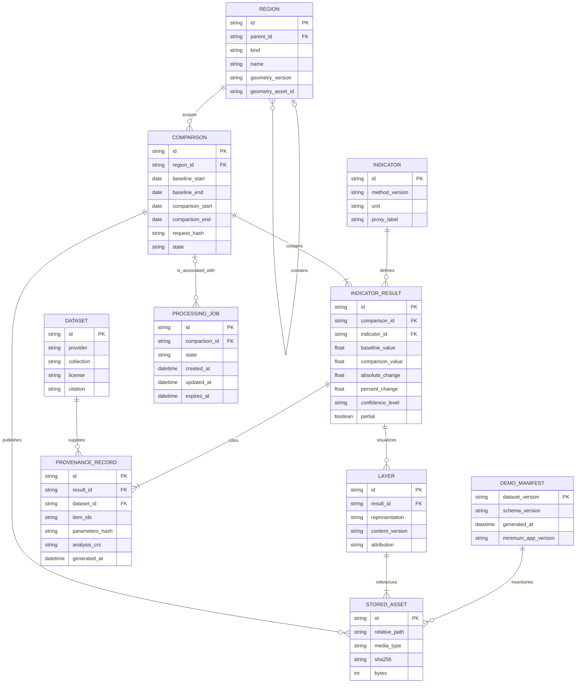

# SPARC data storage architecture

**Status:** Accepted for prototype planning  
**Last updated:** 2026-08-02  
**P0 decision:** No runtime database. Serve versioned static JSON, GeoJSON, PNG/WebP and small XYZ tile sets from local HTTP or a static host.

## 1. Storage principles

1. **Demo reliability first:** the pilot and backup scenario must not depend on a database, object-store login, catalog, tile server, or internet connection.
2. **Immutable scientific results:** a result is identified by its inputs, boundary/method versions and processing provenance. A changed input creates a new result rather than overwriting evidence.
3. **Separate metadata from large raster objects:** future production stores queryable region/result/job metadata in PostgreSQL/PostGIS and large COG/tile/report objects in object storage/CDN.
4. **One public contract:** static and production repositories return the same API data shapes.
5. **Licensed, attributable data only:** every published layer and result carries its source, license/citation and required map attribution.

## 2. P0 storage layout

The following is a proposed implementation layout, not a set of files created by this planning document:

```text
data/
  boundaries/
    source/                 # immutable, licensed source snapshots; not browser-public by default
    normalized/             # versioned validated district/block boundaries
  raw/                      # ignored from Git; selected source rasters if local processing needs them
  interim/                  # ignored/reproducible processing artifacts
  processed/                # immutable analytical outputs and QA reports
  demo/
    v1/
      manifest.json
      regions/
      comparisons/
      layers/
      tiles/
      provenance/
apps/web/public/demo/v1/    # reviewed, size-bounded publishable copy only
```

Raw scenes and unbounded tile pyramids must not be committed to Git. The browser-public copy contains only assets needed for the primary and backup demo scenarios.

### 2.1 P0 formats

| Artifact | Format | Why selected | Constraints |
|---|---|---|---|
| Region index and result payloads | UTF-8 JSON | Direct contract compatibility | Must validate against OpenAPI/JSON Schema; no NaN/Infinity |
| Boundaries and small derived vectors | RFC 7946 GeoJSON | Native MapLibre/browser interoperability | WGS 84 longitude/latitude; simplify only with a documented tolerance and retain analytical source geometry separately |
| Before/after and change overlay | PNG or WebP plus bounds/descriptor | Very reliable static display and offline packaging | Treat as presentation, not analytical raster; include resolution, bounds and attribution |
| Tiled overlay | Small prebuilt XYZ tile set | Predictable pan/zoom without a live tile server | Only generate required zooms/regions; verify every manifest URL; no public OSM prefetch |
| Analytical raster handoff | Optional COG outside the critical browser pack | Range-readable, georeferenced and production-compatible | Object host must support HTTP range requests; include overviews, nodata and validation report |
| Portable vector/QA handoff | Optional GeoPackage | Single-file, transactional SQLite container | Preparation/interchange only; not a concurrent API database |
| Checksums | SHA-256 in manifest | Detect missing/corrupt or accidentally replaced files | Recompute manifest deliberately; a hash proves integrity, not scientific validity |

### 2.2 Demo manifest

The manifest maps canonical logical requests to immutable relative assets. Illustrative schema shape:

```json
{
  "schemaVersion": "1.0.0",
  "datasetVersion": "demo-v1",
  "generatedAt": "2026-08-02T00:00:00Z",
  "minimumAppVersion": "0.1.0",
  "regions": ["MOCK_PRIMARY_REGION", "MOCK_BACKUP_REGION"],
  "requests": {
    "sha256-of-canonical-request": "comparisons/MOCK_COMPARISON.json"
  },
  "assets": [
    {
      "path": "comparisons/MOCK_COMPARISON.json",
      "mediaType": "application/json",
      "bytes": 0,
      "sha256": "MOCK_SHA256"
    }
  ],
  "attributions": ["MOCK ATTRIBUTION — REPLACE BEFORE PUBLICATION"]
}
```

All values above are structural mocks, not real project data. The production manifest validator must reject placeholder values in a release candidate.

## 3. Logical entity model

The P0 files implement this logical model even without a relational database. The same identifiers and relationships can later be persisted in PostgreSQL/PostGIS.



Arrays such as Item IDs and attribution entries are logical collections; a production relational design may normalize them after real query patterns are measured. The model is intentionally not a premature physical database schema.

## 4. Entity responsibilities

| Entity | Input | Output/consumers | Removal impact |
|---|---|---|---|
| `Region` | Licensed boundary record and hierarchy | Selectors, summaries, zonal-processing identity | Results cannot be located or reproduced |
| `Indicator` | Versioned methodology definition | UI method copy and result validation | Numeric values lose meaning/unit/version |
| `Comparison` | Region plus two structured periods | Main dashboard and result grouping | Before/after results cannot be related consistently |
| `IndicatorResult` | Computed metric and evidence | Cards, charts, interpretation and downloads | Core decision-support signal disappears |
| `Layer` | Published map representation | MapLibre adapter | Result retains text but loses spatial evidence |
| `Dataset`/`ProvenanceRecord` | Source catalog identity, citations and processing record | Provenance drawer and audit | Result is not responsibly reproducible |
| `ProcessingJob` | Future live request state | Polling and operations | Only precomputed/cache responses remain possible |
| `DemoManifest`/`StoredAsset` | Build inventory and hashes | Demo transport and verifier | Offline mode cannot resolve or integrity-check its package |

## 5. Versioning and lifecycle

### 5.1 Identity

Result identity includes the region geometry version, selected source Items, date windows, method version, quality mask, threshold/parameters, target grid, analysis CRS and processing environment manifest. A deterministic request/parameters hash is stored, but clients use opaque resource IDs.

### 5.2 Write policy

- `raw/` is append-only and access-controlled where retained; it is not a public application asset.
- `interim/` is reproducible and disposable.
- `processed/` and demo version directories are immutable after verification.
- Corrections create a new dataset/result version and a deprecation record. They do not silently replace evidence.
- Temporary signed provider URLs are never persisted as provenance. Store provider, collection, Item and asset key; resolve access later.

### 5.3 Git policy

- Commit schemas, small examples, manifests, small reviewed boundaries and size-bounded demo assets only.
- Ignore credentials, raw scenes, processing caches, local databases, temporary extracts and unbounded generated tile sets.
- Use Git LFS only after repository-host limits, offline cloning behavior and ownership are explicitly accepted; it is not assumed for P0.

## 6. P0 tool choices and alternatives

| Choice | License/status | Use | Advantages | Limits | Decision |
|---|---|---|---|---|---|
| Static files | Data-specific licenses apply | Demo/runtime results | No service dependency, inspectable, cacheable, portable | Package size and finite supported scenarios | **Selected P0** |
| OGC GeoPackage 1.4 on SQLite | OGC standard; SQLite is public domain | Boundary/derived-vector interchange and analyst QA | Single portable transactional file | File locking and single-writer behavior; not a multi-user API service | Optional preparation artifact |
| DuckDB with Spatial | MIT; active first-party extension | Local SQL analytics/QA over spatial files | Strong analytical SQL and file interoperability | Not an operational multi-user database; offline use requires the extension to be prepackaged | Optional P1 analyst tool, not required P0 |
| PostgreSQL/PostGIS | PostgreSQL License; PostGIS GPL-2.0 | Durable production spatial metadata/querying | Mature concurrency, spatial indexing and SQL | Service/operations cost; unnecessary for two demo packs | Production path, explicitly deferred |
| Object storage/CDN | Provider-specific service terms | Production COG, tile, report and image objects | Durable scalable object delivery and caching | Network/service configuration and cost | Production path; not critical demo dependency |

PostGIS's official FAQ states that ordinary applications using the database do not thereby need to adopt the GPL; distributing a modified PostGIS build has separate GPL obligations. Legal review remains appropriate for a production distribution.

## 7. Production migration

The public API must depend on repository interfaces, not local path construction. A later migration maps:

| P0 concept | Production implementation |
|---|---|
| Manifest region index | `regions` and region-version tables in PostgreSQL/PostGIS |
| Comparison/result JSON | Result metadata rows plus immutable JSON snapshot/object |
| Local image/XYZ path | Object key and CDN URL generated through layer registry |
| Optional COG | Durable object storage key, checksum, bounds and overview metadata |
| Job JSON | Job table with queue/worker state and retention policy |
| Manifest checksum | Object checksum/version plus database uniqueness constraints |

Large rasters should remain in object storage initially. Storing full raster pixels in PostGIS is not justified until a measured query requires database-side raster operations.

## 8. Security, privacy, and resilience

- The static package contains public environmental results only; no user identity or sensitive operational data is planned for P0.
- Resolve relative paths against a fixed package root and reject traversal sequences; never concatenate an untrusted ID into a filesystem path.
- Restrict published media types and inspect SVG/HTML if ever introduced; P0 favors non-executable PNG/WebP and JSON/GeoJSON.
- CORS and object-store access expose only published assets. Provider credentials and private buckets stay server-side.
- Validate byte size and dimensions before publishing imagery and tiles to prevent memory/resource exhaustion.
- Keep at least two verified copies of the final demo pack on separate physical devices plus its source manifest and checksum report.
- A checksum mismatch is a hard integrity error; the UI must not render a partially corrupted scientific result as valid.
- License/attribution fields are required data, not optional UI decoration.

## 9. Acceptance criteria

- No P0 critical journey requires a database or external storage service.
- Every public payload and asset is listed in a versioned manifest with type, byte size and SHA-256.
- Every JSON/GeoJSON payload validates and every URL resolves from a clean local HTTP package.
- Primary and backup district packs are self-contained and visibly distinguish mock from processed values.
- No raw scene, secret, transient signed URL or unauthorized dataset is committed or published.
- A production storage migration can preserve public IDs and response schemas.

## 10. Sources

Official sources were accessed on 2026-08-02.

- [GeoPackage Encoding Standard 1.4.0 — Open Geospatial Consortium](https://www.geopackage.org/spec140/). SQLite container, feature/tile schema and conformance requirements.
- [SQLite copyright — SQLite project](https://www.sqlite.org/copyright.html). Public-domain status.
- [DuckDB Spatial overview — DuckDB Foundation](https://duckdb.org/docs/current/core_extensions/spatial/overview). Spatial extension capabilities and installation model.
- [DuckDB repository — DuckDB Foundation](https://github.com/duckdb/duckdb). MIT license and current maintenance activity.
- [PostGIS FAQ — PostGIS project](https://postgis.net/documentation/faq/gpl-license/). GPL-2.0 licensing implications for applications.
- [PostgreSQL license — PostgreSQL Global Development Group](https://www.postgresql.org/about/licence/). PostgreSQL License terms.
- [OGC Cloud Optimized GeoTIFF Standard 1.0 — Open Geospatial Consortium](https://docs.ogc.org/is/21-026/21-026.html). Range-readable raster organization.
- [RFC 7946: GeoJSON — IETF](https://www.rfc-editor.org/rfc/rfc7946). Public vector exchange format.
