# SPARC offline and demo-safe strategy

**Status:** Accepted for P0  
**Last updated:** 2026-08-02  
**Primary decision:** The critical demonstration runs from a local HTTP server with a versioned primary and backup data pack. It requires no backend process, database, external API, public tile server, runtime CDN, or internet connection.

## 1. Reliability objective

The demo-safe path must support this complete journey offline:

1. Open SPARC from a local HTTP URL.
2. Select the primary or backup district.
3. Compare approved baseline and comparison periods.
4. View water, vegetation and built-up proxy results.
5. Inspect district summary and one block/subdistrict result when available.
6. Use the before/after map and chart/text alternatives.
7. Read confidence, data-quality warnings, provenance and plain-language interpretation.
8. Recover gracefully from WebGL or optional 3D failure.

The local server is the primary offline mechanism. A service worker may be added later as defense in depth after cache-update tests; it is not the only copy of the demo.

## 2. Mode architecture

```mermaid
flowchart LR
    Startup["Browser starts from local HTTP"]
    Config["Read explicit mode and packaged configuration"]
    Gateway["Typed data gateway"]
    API["ApiTransport"]
    Demo["DemoTransport"]
    Health["Short live API capability check"]
    LivePayload["Requested live API response"]
    Manifest["Versioned local manifest"]
    LocalAssets["Local JSON, GeoJSON, image, and XYZ assets"]
    Schema["Shared contract validation"]
    View["Common dashboard view model"]
    Banner["Visible data-mode and generation-date label"]
    Error["Typed recovery state"]

    Startup --> Config
    Config --> Gateway
    Gateway -->|"Explicit demo mode"| Demo
    Gateway -->|"Explicit live mode"| API
    API --> Health
    Health -->|"Available"| LivePayload
    Health -->|"Connectivity, timeout, or 503 and fallback approved"| Demo
    LivePayload --> Schema
    Demo --> Manifest
    Manifest --> LocalAssets
    LocalAssets --> Schema
    Schema -->|"Valid"| View
    Schema -->|"Invalid or missing"| Error
    View --> Banner
    Error --> Banner
```



The fallback is never silent. Validation (`400/422`), authentication (`401/403`), or integrity failures do not trigger automatic substitution with scientifically different data.

## 3. Transport contract

`ApiTransport` and `DemoTransport` implement the same frontend repository interface and return the same generated/validated result types.

| Operation | Live transport | Demo transport |
|---|---|---|
| List regions | `GET /api/v1/regions` | Read region entries from manifest/index payload |
| Region summary | `GET /api/v1/regions/{id}/summary` | Resolve canonical request to packaged JSON |
| Indicator comparison | GET/POST API contract | Resolve supported canonical request key to packaged comparison JSON |
| Layer | Opaque `layerId` descriptor from API | Opaque `layerId` descriptor with local relative asset URLs |
| Provenance/metadata | API metadata endpoints | Packaged contract-shaped metadata JSON |
| Unsupported scenario | Typed `404/422/503` | Typed `DEMO_SCENARIO_UNAVAILABLE`; never synthesize values |

UI components receive a view model and do not contain branching URL logic for live versus demo sources.

## 4. Package contents

```text
demo-bundle/
  index.html
  assets/                       # versioned Vite build output, local fonts and icons
  demo/v1/
    manifest.json
    regions/index.json
    regions/<opaque-id>.json
    comparisons/<opaque-id>.json
    layers/<opaque-id>.json
    geojson/
    images/
    tiles/
    metadata/
    provenance/
  NOTICE.txt                    # library and data attribution notices
  CHECKSUMS.sha256
  START-DEMO.txt                # exact, tested local-launch instructions
  <approved-local-http-launcher>
```

The launcher technology is selected during implementation for the presentation operating system and packaged with all dependencies needed to run offline. Opening `index.html` with `file://` is not an accepted fallback: URL routing, origin/CORS behavior, modules and browser storage/service-worker behavior differ from HTTP and are commonly restricted.

## 5. Manifest rules

`manifest.json` must include:

- contract schema version and demo dataset version;
- generation time and minimum compatible app version;
- primary and backup region IDs;
- supported region/period/indicator combinations;
- canonical request-key-to-payload mapping;
- every asset's relative path, media type, byte size and SHA-256;
- layer bounds, min/max zoom where applicable and offline availability;
- data/provider citations and required map attribution;
- a `mock` flag that must be `false` for evidence claimed as processed real data; and
- known warnings/limitations and pack validation status.

All paths are relative to the fixed demo root. Absolute local paths, `..` traversal, provider credentials and temporary signed URLs are forbidden.

## 6. Basemap and map fallback

- Do not bulk-download or prefetch `tile.openstreetmap.org` tiles. The OpenStreetMap Foundation public tile policy prohibits bulk/offline use and offers no SLA.
- P0 may display analytical overlays over a neutral background with bundled, appropriately licensed administrative context.
- A fully offline basemap is allowed only if its source license explicitly permits the packaged zooms/region and the required attribution is visible.
- If WebGL/MapLibre fails, show reviewed before/after static images plus metric cards, a data table, legend, source and interpretation. Spatial evidence remains available without interactive pan/zoom.

## 7. Optional service-worker layer

A service worker is a later resilience enhancement, not the primary launch dependency.

If implemented, it may precache only:

- the immutable application shell;
- local fonts/icons;
- the primary and backup manifest/payloads; and
- a size-bounded set of critical map assets.

It must not cache authenticated responses, provider requests, temporary signed URLs or arbitrary live results. Cache names include app and demo dataset versions. Activation/update behavior must be tested so an old shell cannot consume an incompatible new dataset, and a visible refresh path must exist.

## 8. Build and verification gates

### Automated/static gates

- Vite production build completes using only locked dependencies.
- A clean-room dependency install/build is performed before the event; no install is required at presentation time.
- OpenAPI parses and all packaged JSON/GeoJSON examples validate.
- Manifest entries exist, hashes/byte sizes match, media types are allowed, and no placeholder/mock flag remains in claimed real results.
- Every layer descriptor has valid bounds, legend, unit, resolution, attribution and relative URL.
- HTML/JavaScript/CSS/fonts/icons have no required remote runtime URL.
- The package contains no secret pattern, `.env` content, source provider credential or private raw asset.

### Manual gates

- Launch from a clean presentation laptop using only the included instructions.
- Disable Wi-Fi/network before startup and complete the primary journey.
- Repeat the journey for the backup district.
- Test API-down fallback with a visible mode change.
- Test a missing layer, missing JSON and corrupt-hash recovery.
- Disable WebGL and confirm static map/text/table fallback.
- Request reduced motion and confirm the optional 3D/transition does not auto-animate.
- Check keyboard-only navigation, zoom, screen-reader labels and color-independent meaning.
- Restart the browser and local server; verify no hidden warm cache is required.

## 9. Rehearsal and copies

Before feature freeze, create one immutable release directory and checksum report. Keep tested copies on:

1. the primary presentation laptop;
2. a separate removable/offline device; and
3. the backup presenter's device or another separately verified medium.

Do not edit those copies during final rehearsal. A correction creates a new version and repeats the verification checklist.

The demo script must include the exact local launch command/action, expected URL, expected first screen, recovery to backup district, and a timed WebGL/API/internet-failure branch.

## 10. Failure ladder

| Failure | Detection | Immediate behavior | Presenter recovery |
|---|---|---|---|
| Internet/catalog unavailable | Network check fails or times out | Remain/enter disclosed demo mode | Continue full local journey |
| FastAPI unavailable | Short health check fails with network/timeout/503 | Offer/activate demo mode under approved policy | Explain identical contract and precomputed evidence |
| Local launcher fails | No response on expected loopback URL | Stop; do not improvise with `file://` | Use separately tested backup device/copy |
| Primary pack corrupt/missing | Manifest/hash validation fails | Do not render affected values | Select verified backup district pack |
| One layer fails | Asset request/error or WebGL context loss | Static image and metric/table remain | Continue without interactive map |
| Contract mismatch | Schema version/payload validation fails | Typed incompatible-data screen | Use matching immutable backup bundle |
| 3D asset/runtime fails | Load, timeout, capability or budget gate | Accessible 2D poster/dashboard | Skip optional showcase |
| Public basemap unavailable | No external map request is required | Neutral bundled context remains | Continue; attribution still visible |

## 11. Security and responsible communication

- Bind the demo server to loopback by default rather than the venue network unless shared access is explicitly required and reviewed.
- Serve a fixed directory read-only; disable directory listing, upload, execution and arbitrary path access.
- Use opaque logical IDs and allowlisted relative paths.
- Never place secret provider credentials in Vite environment variables, static JavaScript, manifests or launch scripts.
- Show `Precomputed demo data`, generation time, selected periods, quality and provenance. Do not describe the pack as live or real-time.
- Clearly distinguish mock contract examples from actual processed pilot results.

## 12. Acceptance criteria

- Primary and backup P0 journeys complete with the network disabled from a cold browser start.
- Local HTTP launch is documented and tested on the actual presentation operating system.
- The demo bundle is self-contained, hash-verified and free of required remote origins.
- Live and demo transports pass the same contract fixtures and produce the same view-model states.
- A user can tell whether data are live, cached or precomputed and when they were generated.
- WebGL, API, tile, 3D and internet failure each preserve a usable analytical result or a clear supported recovery.

## 13. Sources

Official sources were accessed on 2026-08-02.

- [OpenStreetMap tile usage policy — OpenStreetMap Foundation](https://operations.osmfoundation.org/policies/tiles/). Attribution, caching, no-SLA and prohibited bulk/offline downloading rules for the public tile service.
- [Vite static deployment guide — Vite project](https://vite.dev/guide/static-deploy.html). Production build/static serving model. The Vite preview server is for local preview, not a production-server commitment.
- [Service Workers specification — W3C](https://www.w3.org/TR/service-workers/). Origin, lifecycle, fetch and cache behavior.
- [Secure Contexts specification — W3C](https://www.w3.org/TR/secure-contexts/). Trustworthiness treatment for loopback/local development origins.
- [Subresource Integrity — W3C](https://www.w3.org/TR/SRI/). Integrity model for fetched resources; SPARC additionally uses a package manifest/checksum verifier for local data assets.
- [WCAG 2.2 — W3C](https://www.w3.org/TR/WCAG22/). Accessible alternatives, keyboard behavior and status communication.
