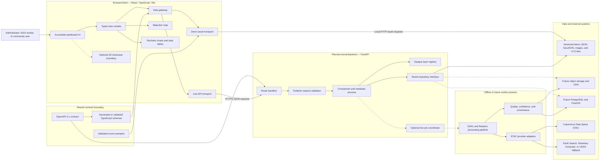

# SPARC system architecture

**Status:** Accepted for prototype planning  
**Last updated:** 2026-08-02  
**Scope:** Architecture only; this document does not implement an application.

## 1. Architectural outcome

SPARC will be a modular monolith with two interchangeable data modes:

- **Live or semi-live mode:** a React browser client calls a planned FastAPI service. The service returns existing results immediately or coordinates bounded processing outside the request path.
- **Demo-safe mode:** the same browser-facing repository reads precomputed, versioned assets from a local HTTP server. Payloads conform to the same schemas as live responses.

The 3-to-4-day prototype is **precomputed first**. External catalog access, raster processing, a database, dynamic tile serving, and 3D rendering are not required for the critical demonstration path.

## 2. Context and trust boundaries

Solid arrows are required for the P0 path. Dotted arrows are optional or production-oriented paths.

## 3. Runtime classification

| Area | Classification | What runs there | Inputs | Outputs | Failure effect |
|---|---|---|---|---|---|
| React application | Browser/client code | Region selection, accessibility, map and chart rendering, explicit mode selection | Typed API or demo payloads and user actions | Screen state and safe HTTP requests | UI shows a typed error or disclosed demo fallback |
| Vite | Build/configuration code | Compiles and bundles the React application | Source files and public demo assets | Static web build | No build artifact; it is not a runtime backend |
| Contract package | Shared/build code | OpenAPI, JSON examples, generated or validated TypeScript types | Contract changes | Compile-time types and validation evidence | Frontend and backend can drift if checks are bypassed |
| FastAPI application | Server/backend code | Route handling, validation, cache lookup, response composition, safe job coordination | HTTP requests and server-only configuration | JSON responses and opaque layer descriptors | Live mode is unavailable; demo mode remains usable |
| Geospatial pipeline | Server-side/offline processing code | Catalog selection, raster masking, index calculation, zonal statistics, quality and provenance | Provider metadata, imagery assets, region geometry and method configuration | Derived rasters, vectors, summaries and manifests | Existing precomputed output remains usable; fresh processing fails |
| Static demo pack | Data, not executable code | Immutable examples and selected real derived results | Build-time generated artifacts | Contract-shaped JSON and map assets | A missing or corrupt asset affects only its declared scenario |
| Future PostGIS/object storage | Database/storage services | Metadata, job state, spatial lookup, COGs and tiles | Server/worker writes | Durable live-mode records and objects | Live requests may degrade or fail; not part of P0 |

### Browser/server security rule

The browser is untrusted. It may perform presentation checks, but the planned server must repeat all authorization, identifier, enum, date-range, size, and domain validation. Private provider credentials must be read only from server-side environment variables. No private key may be compiled into Vite variables or delivered to the browser.

## 4. Component responsibilities

### 4.1 Browser application

**Responsibilities**

- Render district and block/subdistrict comparisons.
- Use one typed data gateway so live and demo payloads produce identical view models.
- Render raster/image/vector layers through MapLibre and simple charts through Recharts.
- Preserve text/table equivalents for color, map, and chart information.
- Label data mode, dates, provenance, proxy status, quality, partial results, and uncertainty.
- Lazy-load any later 3D experience and keep it outside the analytical dependency chain.

**Must not**

- Contain provider secrets or direct authenticated imagery calls.
- Decide scientific thresholds or calculate authoritative area statistics.
- accept a remote raster URL and pass it to a tile service.
- silently replace a failed live result with an older demo result.

### 4.2 FastAPI service

**Responsibilities**

- Implement the reviewed OpenAPI contract.
- Validate and canonicalize request values before business logic.
- Return precomputed/cache results synchronously.
- Return `202 Accepted` and an opaque job URL only when live processing is enabled and necessary.
- Resolve opaque `layerId` values through an allowlisted layer registry.
- Return RFC 9457 problem responses without stack traces, credentials, filesystem paths, or raw provider responses.

Raster computation must not run inside a latency-sensitive route handler. A cache miss is either a bounded future job or an explicit unavailable response.

### 4.3 Geospatial processing module

The processing code is one cohesive package callable from a build-time CLI and, later, an asynchronous worker. It owns:

- provider-neutral scene discovery;
- pixel-level cloud/no-data masking;
- spatial alignment and projected-area calculations;
- documented indicator algorithms;
- deterministic result identifiers;
- quality, confidence, provenance, and asset-manifest generation.

It does not own HTTP presentation, UI wording, or client state.

### 4.4 Storage adapters

The result repository hides whether an object is read from a demo directory or future durable services. P0 uses static files and no database. Future production may use PostgreSQL/PostGIS for metadata and object storage for large raster objects; the public response schema remains stable.

## 5. Technology choices

The versions below are planning constraints, not permission to install packages during this phase.

| Component | Selected role | License | Maintenance signal as of 2026-08-02 | Prototype position | Production position |
|---|---|---|---|---|---|
| React | Browser component model | MIT | Active official repository | Selected | Suitable with tested upgrades |
| TypeScript | Static typing for browser and shared schemas | Apache-2.0 | Active official repository | Selected | Selected |
| Vite | Browser build tool and development server | MIT | Active official repository | Selected | Builds static CDN assets |
| FastAPI and Pydantic | Planned API and server validation | MIT | Active official projects and current documentation | Contract/API skeleton during implementation; demo must not depend on it | Selected modular-monolith API |
| MapLibre GL JS | Two-dimensional map rendering | BSD-3-Clause | Active; v6 introduced ESM-only and WebGL2-only requirements in July 2026 | Pin an exact tested pre-v6 release; do not use an unbounded `latest` range | Re-evaluate v6 after compatibility testing |
| Recharts | Simple React charts | MIT | Active 3.x releases in 2026 | Selected with semantic table/text fallback | Suitable for modest result sets |
| GDAL, Rasterio, GeoPandas, Shapely and NumPy | Offline geospatial processing | Permissive licenses; Shapely uses the LGPL-licensed GEOS library | All have active official projects | Selected and container-pinned during implementation | Selected; scale through windowed reads and durable workers |

Distribution must retain required license and NOTICE texts. User-visible map/data attribution is separate from library-license notice and is carried in every layer/provenance object.

## 6. P0, P1, and production boundaries

### P0

- One primary and one backup district package.
- Static JSON/GeoJSON and prebuilt PNG/WebP/XYZ layer assets.
- No runtime database, dynamic tile service, processing queue, or provider dependency.
- FastAPI-compatible contract and mocks; live API may serve the same precomputed artifacts.
- MapLibre two-dimensional map, Recharts summaries, accessible text and table alternatives.

### P1

- Automated scene discovery and cache warming.
- Bounded live jobs and job polling.
- Optional time series and land-surface temperature.
- Optional user-provided 3D showcase after asset inspection.
- COG-backed dynamic tile delivery only if static layers are insufficient.

### Production evolution

- Object storage plus CDN for COGs and tiles.
- Managed PostgreSQL/PostGIS for region, job, result and provenance metadata.
- Dedicated worker/queue only when measured processing demand requires it.
- Provider health checks, retry budgets, observability, retention, backup and cost controls.

Kubernetes, separate microservices, user authentication, Dask, DuckDB in the serving path, TiTiler, and PostGIS are deliberately outside P0.

## 7. Quality, failure, and security controls

| Concern | Architectural control | User-visible behavior |
|---|---|---|
| Catalog or internet outage | Precomputed primary and backup packs | Disclosed demo mode remains complete |
| API outage | Demo transport over local HTTP | Banner identifies the source and generation date |
| Contract drift | One OpenAPI source, validated examples, generated/validated types and integration gate | Incompatible build is rejected before demo |
| Provider throttling | Provider adapter, bounded retry, cache and fallback catalog | Queued/unavailable status rather than a hanging screen |
| Raster URL abuse | Opaque layer IDs and outbound-host allowlist | Invalid layer ID returns a safe 404 |
| Hostile upstream raster or driver confusion | Acquisition/parser separation, explicit driver restriction, resource caps, credential-free worker and verified publication; see [pipeline hardening](pipeline-hardening.md) | Asset and derived output remain quarantined; existing verified demo results stay available |
| Seasonal or cloud bias | Same-season windows, common-valid footprint, quality fields and warnings | Caveat is displayed beside the metric |
| WebGL failure | Static image and text/table fallback | Core comparison remains usable |
| 3D incompatibility | Optional isolated route/module and neutral placeholder contract | 2D dashboard is unaffected |
| Secret exposure | Server-only environment variables, log/response redaction and no `VITE_*` secrets | No credential enters browser assets |

## 8. Related decisions

- [ADR-001: Data access strategy](../decisions/ADR-001-data-access-strategy.md)
- [ADR-002: Geospatial processing stack](../decisions/ADR-002-geospatial-processing-stack.md)
- [ADR-003: Storage format](../decisions/ADR-003-storage-format.md)
- [ADR-004: API contract](../decisions/ADR-004-api-contract.md)
- [ADR-005: Map library](../decisions/ADR-005-map-library.md)
- [ADR-006: User-provided 3D assets](../decisions/ADR-006-user-provided-3d-assets.md)
- [ADR-008: Demo and offline strategy](../decisions/ADR-008-demo-offline-strategy.md)

## 9. Sources

Official sources were accessed on 2026-08-02.

- [OpenAPI Specification 3.1.2 — OpenAPI Initiative](https://spec.openapis.org/oas/v3.1.2.html). Defines the API description format; the exact supported 3.1 patch must be verified against implementation tooling.
- [FastAPI features — FastAPI project](https://fastapi.tiangolo.com/features/). Documents OpenAPI, JSON Schema, validation and dependency-injection capabilities.
- [React license — Meta Open Source](https://github.com/facebook/react/blob/main/LICENSE). MIT license.
- [TypeScript license — Microsoft](https://github.com/microsoft/TypeScript/blob/main/LICENSE.txt). Apache-2.0 license.
- [Vite repository — Vite project](https://github.com/vitejs/vite). Official project status and MIT license.
- [MapLibre GL JS repository and releases — MapLibre](https://github.com/maplibre/maplibre-gl-js). BSD-3-Clause license and release history.
- [Recharts repository and releases — Recharts Group](https://github.com/recharts/recharts). MIT license and active release history.
- [GDAL overview and license — Open Source Geospatial Foundation](https://gdal.org/en/stable/about.html). Format/CRS capability and MIT-style license.
- [Rasterio repository — Rasterio contributors](https://github.com/rasterio/rasterio). BSD-3-Clause license, dependencies and maintenance status.
- [GeoPandas repository — GeoPandas contributors](https://github.com/geopandas/geopandas). BSD-3-Clause license and maintenance status.
- [Shapely repository — Shapely contributors](https://github.com/shapely/shapely). BSD-3-Clause license; documents its GEOS dependency.
- [NumPy repository — NumPy developers](https://github.com/numpy/numpy). BSD-3-Clause license and maintenance status.
