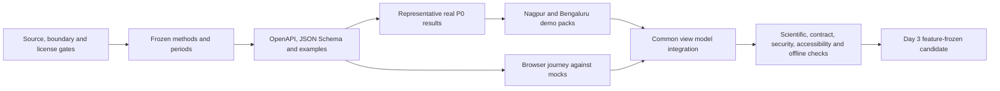

# SPARC development roadmap

**Status:** implementation roadmap; no application code exists yet  
**Delivery window:** Day 0 through Day 3, with optional Day 4 contingency  
**Contract freeze:** end of Day 0  
**Primary pilot:** Nagpur district; **backup:** Bengaluru Urban

## 1. Delivery outcome

The target is a reliable, explainable prototype—not a national production platform. By the Day 3 feature freeze, a reviewer must be able to complete the Nagpur comparison journey from a local HTTP bundle without internet, inspect water, vegetation and built-up proxy results, drill down to at least one boundary- and data-validated Nagpur subdistrict, and see periods, quality evidence, provenance and limitations. Hingna is only the provisional child-region candidate until boundary and data QA pass. Bengaluru Urban must be a separately verified recovery pack.

The critical path uses precomputed immutable results. Live catalog discovery, Landsat land-surface temperature (LST), a processing queue, cloud hosting and user-provided 3D assets are enhancements. No P0 deliverable first appears on optional Day 4.

Period decisions are not interchangeable: Nagpur P0 optical windows are fixed at 2019-10-15–2019-12-15 and 2024-10-15–2024-12-15; optional Nagpur P1 LST windows are fixed at 2019-03-01–2019-05-15 and 2024-03-01–2024-05-15. Bengaluru Urban 2019-01-15–2019-03-15 versus the same 2024 dates is only a candidate backup window pending catalog and data QA.

## 2. Workstreams and runtime boundaries

| Workstream | Primary owner | Planned paths | Runtime classification | Main output |
|---|---|---|---|---|
| Data, processing and API | Codex | `services/geoprocessing/**`, `apps/api/**`, `scripts/data/**`, `tests/{processing,api,contract}/**` | Server/backend and offline processing | Reproducible results, provenance, demo packs and a contract-compatible FastAPI service |
| Browser experience | Claude | `apps/web/**`, `tests/frontend/**`, UI documentation | Browser/client and Vite build | Accessible dashboard using the frozen mock/API shapes |
| Contract and integration | Shared, Codex primary editor | `contracts/**`, `packages/contracts/**`, `tests/integration/**` | Shared/build | One schema boundary used by both transports |
| Release and evidence | Shared | `data/demo/**`, `infra/**`, judging and test evidence | Static data/build/deployment | Verified offline candidate, recovery copy and claim-safe presentation |

The detailed path rules are in [repository ownership](repository-ownership.md) and [Git workflow](git-workflow.md).

## 3. Planned end-to-end request flow

```text
User selects Nagpur, an indicator, and the frozen 2019/2024 periods
→ React event handler validates required selections in the browser
→ the typed data gateway chooses DemoTransport or ApiTransport
→ DemoTransport resolves a canonical key in the local manifest
  OR ApiTransport sends the reviewed /api/v1 request
→ FastAPI repeats identifier, enum, period and authorization validation
→ a result repository returns an immutable result or a restricted live job is queued
→ contract-shaped JSON and opaque layer descriptors return to the browser
→ React renders metrics, maps or static fallbacks, quality, provenance and caveats
```

Browser validation improves feedback; it is never a security boundary. Server validation remains mandatory for every HTTP request.

## 4. Critical dependency chain



If a dependency fails, scope is reduced at that boundary. The team must not conceal missing evidence with UI polish or move an unverified P0 item to Day 4.

## 5. Day-by-day execution

### Day 0 — evidence, scope and contract freeze

The two workstreams begin in parallel after shared terminology and contract decisions are explicit.

#### Data/API stream

- [ ] **D0-DATA-01 — Run metadata-only discovery for both districts.**  
  Dependency: none.  
  Output: candidate item IDs, acquisition times, processing baselines, cloud metadata, band availability and fallback provider route.  
  Acceptance: Nagpur 2019-10-15–2019-12-15 and 2024-10-15–2024-12-15 are checked without silently changing dates. Bengaluru Urban 2019-01-15–2019-03-15 versus the same dates in 2024 remains a candidate backup window until its own catalog and data QA pass.  
  Fallback: use approved preselected local inputs from the fixed Nagpur windows; if they are not suitable, withhold the real Nagpur finding rather than move its dates.

- [ ] **D0-DATA-02 — Freeze boundary source and redistribution record.**  
  Dependency: source/license review.  
  Output: stable region IDs, source/version, attribution, geometry hash and at least one Nagpur child region.  
  Acceptance: the exact dataset terms permit the intended bundle.  
  Fallback: publish only derived/approved geometry artifacts or switch to the next approved source.

- [ ] **D0-DATA-03 — Freeze P0 methods.**  
  Dependency: discovery and boundary decision.  
  Output: MNDWI water at 20 m, per-observation NDVI at 10 m and Sentinel-2 spectral built-up proxy at 20 m, with fixed cross-period rules.  
  Acceptance: formulas, masks, grids, thresholds/sensitivity and stop rules match [indicator methodology](indicator-methodology.md).  
  Fallback: retain the simpler documented fixed method and downgrade or withhold unstable public claims.

- [ ] **D0-DATA-04 — Freeze contracts and examples.**  
  Dependency: D0-DATA-03.  
  Output: parsed OpenAPI, canonical JSON Schema and valid synthetic examples.  
  Acceptance: browser and server owners agree on operations, field meanings, units, partial states and RFC 9457-style errors.  
  Fallback: remove optional operations while preserving comparisons, quality, provenance and layers.

#### Browser stream

- [ ] **D0-WEB-01 — Map contract objects to screen states.**  
  Dependency: draft contract.  
  Output: dashboard, indicator detail, child-region, loading, empty, partial, unavailable and incompatible-data states.  
  Acceptance: every P0 server state has a mock or explicit client-only state.  
  Fallback: use fixture-backed tables and static images before interactive mapping.

- [ ] **D0-WEB-02 — Freeze accessible screen flow.**  
  Dependency: D0-WEB-01.  
  Output: keyboard order, responsive structure, visible mode badge, quality/provenance placement and non-WebGL alternative.  
  Acceptance: the planned journey can be completed without 3D, animation, hover or color-only meaning.  
  Fallback: remove decorative interactions and preserve controls, tables and text.

#### Shared checkpoint

- [ ] OpenAPI, schema and examples agree.
- [ ] Ownership and branch rules are accepted.
- [ ] Private credentials are server-only; no secret uses a `VITE_*` name.
- [ ] P0/P1/P2 language and pilot windows match across documentation.
- [ ] The contract freezes at end of day.

### Day 1 — independent core slices

#### Data/API stream

- [ ] **D1-DATA-01 — Build deterministic boundary/composite preprocessing.**  
  Dependency: D0-DATA-01 through D0-DATA-03.  
  Output: aligned common-valid composites, versioned provenance and reproducible parameters.  
  Acceptance: rerun with identical inputs yields identical checksums; nodata, masks, CRS and scene IDs are recorded.  
  Fallback: use approved preselected scenes and locally retained inputs.

- [ ] **D1-DATA-02 — Produce one representative result per P0 method.**  
  Dependency: D1-DATA-01.  
  Output: water, vegetation and built-up result objects with sensitivity and caveats.  
  Acceptance: formulas and units pass synthetic fixtures; identical thresholds apply to both periods.  
  Fallback: mark the result low quality or `NOT_SUITABLE_FOR_PUBLIC_CLAIM`; do not fabricate certainty.

- [ ] **D1-API-03 — Build read-only result serving to the contract.**  
  Dependency: frozen contract.  
  Output: health, region, summary, indicator, comparison, layer, metadata and structured-error paths reading immutable files.  
  Acceptance: request handlers do not perform unbounded raster processing and do not accept caller-provided URLs or paths.  
  Fallback: retain DemoTransport as the judged path while repairing API behavior.

#### Browser stream

- [ ] **D1-WEB-01 — Build shell and selection flow against mocks.**  
  Dependency: D0-WEB-01 and frozen examples.  
  Output: responsive app shell, district/period/indicator controls, summary cards and typed data gateway.  
  Acceptance: the synthetic-mock journey works by keyboard at desktop and 360 CSS pixels.  
  Fallback: accessible list/table controls without map interaction.

- [ ] **D1-WEB-02 — Build evidence and failure components.**  
  Dependency: D1-WEB-01.  
  Output: quality explanation, provenance drawer, partial/empty/error states, demo badge, static map fallback and neutral 3D placeholder.  
  Acceptance: users can identify data mode, dates, source, proxy status and limitations without developer tools.  
  Fallback: inline text panels and reviewed static image.

#### Shared checkpoint

- [ ] Three representative contract-valid P0 outputs exist.
- [ ] The browser renders every committed mock state without an API.
- [ ] Contract drift is zero.
- [ ] A risk owner and fallback are recorded for every failed gate.

### Day 2 — complete P0 journey and integrate

#### Data/API stream

- [ ] **D2-DATA-01 — Generate versioned Nagpur pack.**  
  Dependency: verified Day 1 pipeline.  
  Output: district plus at least one child-region result, layers, manifest, checksums, quality and provenance.  
  Acceptance: every asset resolves and every payload validates; no mock flag or placeholder remains in claimed real evidence.  
  Fallback: district-only Nagpur if no child region passes boundary/data QA; do not present provisional Hingna output as validated.

- [ ] **D2-DATA-02 — Generate independent Bengaluru Urban backup pack.**  
  Dependency: same pipeline and method versions.  
  Output: separately versioned backup result and assets.  
  Acceptance: the same manifest, schema, attribution, checksum and offline checks pass.  
  Fallback: district-level backup only, clearly distinguished from Nagpur.

- [ ] **D2-API-03 — Complete comparison semantics.**  
  Dependency: D2-DATA-01.  
  Output: deterministic cache/demo hits, partial results, idempotency behavior and safe problem responses.  
  Acceptance: normal and planned failure cases match `contracts/openapi.yaml`.  
  Fallback: disable restricted live job creation and serve read-only precomputed results.

#### Browser stream

- [ ] **D2-WEB-01 — Complete analytical views.**  
  Dependency: D1-WEB-02 and a real contract-valid pack.  
  Output: district summary, before/after indicator views, tables/charts, child-region drill-down, interpretation, quality and provenance.  
  Acceptance: a non-specialist can finish the scripted journey without remote-sensing vocabulary.  
  Fallback: static overlays plus metric and data tables.

- [ ] **D2-WEB-02 — Connect both transports.**  
  Dependency: D2-API-03.  
  Output: `DemoTransport` and `ApiTransport` producing the same view-model states.  
  Acceptance: changing transport does not change metric meaning, caveats or screen structure.  
  Fallback: freeze release candidate on DemoTransport.

#### Shared integration checkpoint

- [ ] Merge owned slices into `integration/day-2` in the order defined by [Git workflow](git-workflow.md).
- [ ] Run schema, API, browser, offline and secret checks.
- [ ] Complete primary and backup critical journeys.
- [ ] Record defects with layer ownership: UI, client logic, network, route, validation, business logic, storage or provider.
- [ ] Merge only if the demo transport remains runnable.

### Day 3 — reliability, evidence and feature freeze

#### Data/API stream

- [ ] **D3-DATA-01 — Reproduce and audit release data.**  
  Dependency: Day 2 packs.  
  Output: method/version record, hashes, QA summary, attribution and validation status.  
  Acceptance: published values are traceable to stable item IDs and parameters; mock data are not presented as findings.  
  Fallback: label unvalidated results exploratory or withhold the affected public claim.

- [ ] **D3-OPS-02 — Prepare optional cloud candidate without touching local release.**  
  Dependency: verified offline release.  
  Output: reproducible static/API deployment notes and health evidence.  
  Acceptance: cloud failure cannot break the local candidate.  
  Fallback: do not deploy; present locally.

#### Browser stream

- [ ] **D3-WEB-01 — Finish accessibility and responsive verification.**  
  Dependency: integrated Day 2 candidate.  
  Output: keyboard, visible focus, 360 px, 200% zoom, reduced-motion, status-message and text-alternative evidence.  
  Acceptance: critical journey passes without WebGL and without optional 3D.  
  Fallback: remove animation and interactive map dependence.

- [ ] **D3-WEB-02 — Freeze presentation visuals.**  
  Dependency: D3-WEB-01.  
  Output: readable final states, no placeholder claims and a pre-openable backup view.  
  Acceptance: no UI label implies official SDG measurement, real-time data or causation.  
  Fallback: use reviewed static evidence screens.

#### Shared release checkpoint

- [ ] Execute [testing plan](testing-plan.md) gates.
- [ ] Verify primary and backup twice with network disabled, including one cold start.
- [ ] Force API, layer and WebGL failures and observe the documented recovery.
- [ ] Create an immutable release directory and checksum report.
- [ ] Keep two separately tested recovery copies.
- [ ] Complete two consecutive 5–7 minute rehearsals.
- [ ] Tag and preserve the verified candidate before any P1 experiment.

### Optional Day 4 — contingency, not deferred P0 development

- [ ] Fix only release-blocking defects against the preserved Day 3 candidate; rerun affected and regression checks.
- [ ] If—and only if—the user supplies licensed assets, inspect optional 3D format, references, size, safety, accessibility and performance in isolation.
- [ ] Integrate 3D only if zero model/runtime bytes enter the critical dashboard path and the 2D fallback still passes.
- [ ] Create final submission and recovery copies from a verified candidate.

Day 4 must not introduce a new P0 method, region, screen, contract shape or data pack. If a required item is absent at Day 3 freeze, the release is not ready; it is not relabelled as a Day 4 enhancement.

## 6. Scope-cut order

When time is constrained, remove work in this order:

1. optional 3D showcase;
2. cloud deployment;
3. live processing/job queue;
4. LST/SUHI and time series;
5. dynamic tiles and decorative animation;
6. additional child regions beyond the minimum drill-down.

Never cut contract validation, scientific caveats, provenance, quality evidence, offline mode, the backup pack, basic accessibility or secret protection to preserve an enhancement.

## 7. Release definition of done

A Day 3 candidate is releaseable only when:

- [ ] Nagpur and Bengaluru packs validate and have matching hashes.
- [ ] Nagpur uses the frozen 2019 and 2024 post-monsoon windows exactly; an unavailable fixed window withholds the finding rather than silently moving dates.
- [ ] MNDWI, NDVI and built-up proxy methods use fixed cross-period rules.
- [ ] LST, if present, is labelled P1 surface temperature from Landsat Collection 2 Level-2—not air temperature.
- [ ] Every result displays source, periods, method version, proxy wording, quality components and caveats.
- [ ] No public claim relies on synthetic contract examples.
- [ ] No official UN SDG value or causal claim is asserted.
- [ ] Browser and server consumers pass the same contract fixtures.
- [ ] The complete journey works from local HTTP with internet, FastAPI and WebGL unavailable.
- [ ] A secret scan, license/attribution review and accessibility check pass.
- [ ] The exact tested launch action and URL are recorded in the release copy.

## 8. Learning focus

The implementation demonstrates three foundational concepts:

1. **Client versus server:** React renders and performs convenience validation; FastAPI protects the trust boundary and secrets.
2. **HTTP contracts:** OpenAPI and JSON Schema define what crosses that boundary, including success, partial and error responses.
3. **Reproducible data products:** a metric is only useful when its inputs, method, common-valid footprint, validation status and limitations travel with it.

Related evidence: [SRS](../SRS.md), [system architecture](architecture/system-architecture.md), [validation plan](validation-plan.md), [risk register](risk-register.md) and [demo script](demo-script.md).
