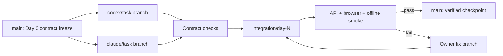
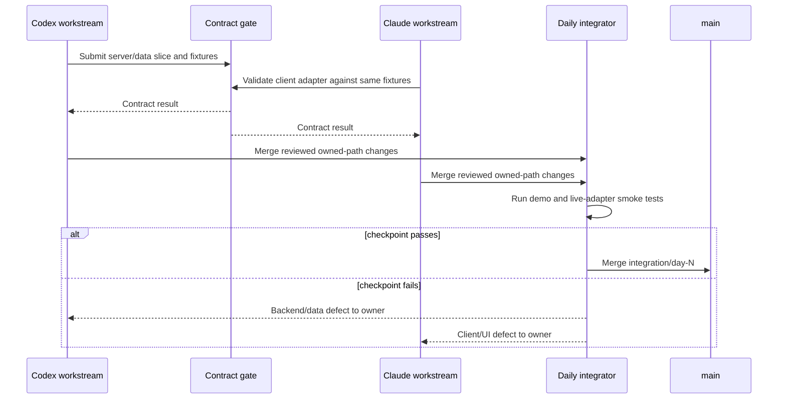

# Git workflow

This is the planned two-developer workflow for the 3–4 day implementation. It is intentionally small: protected `main`, short-lived work branches, and one daily integration branch.

## Branches

| Purpose | Pattern | Owner | Lifetime |
|---|---|---|---|
| Releasable baseline | `main` | Shared | Permanent |
| Backend/data task | `codex/<short-task>` | Codex | Hours to one day |
| Frontend task | `claude/<short-task>` | Claude | Hours to one day |
| Daily convergence | `integration/day-N` | Assigned integrator | One checkpoint; delete after merge |
| Urgent release correction | `codex/fix-<issue>` or `claude/fix-<issue>` | Path owner | Short-lived |

Do not keep a parallel long-lived `develop` branch. It adds another source of truth without helping a two-person hackathon team.

## Commit and pull-request rules

- Use an imperative subject with an optional scope, such as `docs(contract): freeze comparison examples` or `feat(web): render quality status`.
- Keep contract changes, processing logic, UI work, and generated/demo artifacts distinguishable in review.
- Pull requests identify owned paths, contract impact, tests run, known gaps, and fallback impact.
- No direct feature commits to `main` after Day 0.
- Never commit `.env` files, credentials, provider tokens, signed URLs, raw scenes, caches, or unapproved model binaries.
- Do not rewrite shared published history during the event.

## Merge order

1. Merge Day 0 planning, ownership, OpenAPI, schemas, and mocks to `main`.
2. Create `integration/day-1` from that exact commit.
3. Merge or cherry-pick the smallest reviewed contract-compatible backend slice.
4. Merge the frontend slice that consumes mocks or the same API shape.
5. Run contract, smoke, and offline checks; fix on owner branches.
6. Merge the verified integration branch to `main`.
7. Repeat from the current `main` for Day 2 and Day 3.

Backend-first in a checkpoint does not mean frontend waits for backend: Claude develops against frozen examples from Day 0. It only makes the integration diff easier to diagnose.

## Workflow diagram

## Daily integration sequence

## Breaking-change procedure

After the end-of-Day-0 freeze:

1. Open a change note stating the old shape, proposed shape, reason, consumers, and rollback.
2. Classify compatibility. A required field, removed field, enum narrowing, unit/semantic change, or URL/status behavior change is breaking.
3. Obtain both workstream approvals.
4. Update JSON Schema, OpenAPI, all affected mocks, documentation, and contract tests together.
5. Update backend and frontend adapters in the same daily integration branch.
6. Increment the schema version when compatibility or meaning changes.
7. Verify old demo data is migrated or intentionally rejected with a clear error.

If this cannot fit safely in the checkpoint, keep v1 unchanged and defer the new behavior. A brittle last-minute contract change is worse than omitting a P1 feature.

## Conflict resolution

- Stop competing edits to the conflicted shared file.
- The primary path owner rebases or recreates the smallest change on the current integration branch.
- Resolve semantics from the canonical contract and ADRs, not by choosing whichever side is newer.
- Re-run both consumer tests after resolution.
- Never resolve JSON or generated types by accepting an entire side without inspecting the schema meaning.

## Release tags and rollback

At the Day 3 feature freeze, tag a verified candidate such as `prototype-rc1`. Preserve the last working offline candidate before adding any optional 3D or P1 refinement. If a late change breaks the judged path, deploy or run the preserved candidate rather than debugging live during the presentation.
