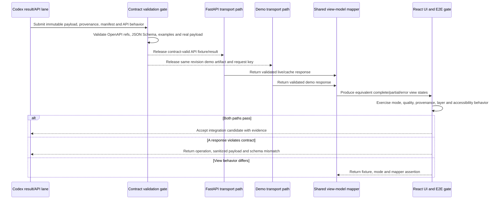

# Integration plan

**Status:** Integration plan; the browser/API contract now includes a validated Nagpur/Bengaluru path plus a versioned global city catalog with explicit report/export fallbacks. See [delivery status](./project-status.md) and [supported-city catalog](./city-catalog.md).
**Integrators:** Codex and Claude alternate or nominate one owner each day  
**Branch pattern:** `integration/day-N` from the current verified `main`  
**Primary rule:** A daily checkpoint is merged only when the same frozen contract works through both the API and demo transports.

This document defines how separately owned backend/data and frontend work becomes one verified SPARC candidate. It does not create runtime code, dependencies, CI jobs or deployment resources.

## 1. Integration scope

The integration boundary contains five independently testable parts:

1. canonical [OpenAPI](../contracts/openapi.yaml), [JSON Schema](../packages/contracts/schemas/sparc.schema.json) and [mock examples](../contracts/examples/README.md);
2. planned FastAPI routes and immutable result repository owned by Codex;
3. planned React + TypeScript + Vite data gateway and UI owned by Claude;
4. versioned processed/demo payloads, layer descriptors, manifests and local assets owned by Codex and consumed by Claude; and
5. the local HTTP release bundle and end-to-end demo journey owned jointly.

The P0 serving path has no database requirement. Raster processing does not run inside request handlers. External catalog/data APIs are used only by a server-side or offline processing adapter and are not required for the judged offline journey.

### City-catalog integration gate

The quick-target picker reads [`data/catalog/supported-cities.json`](../data/catalog/supported-cities.json).
Every entry has a country code, administrative area, centroid/bbox, boundary
definition, analytics coverage state, processing-pack status/checksums, and a
jurisdiction-pack reference. Run
`\.venv\Scripts\python.exe scripts/validate_city_catalog.py` before merging a
catalog change. The validator binds the two validated entries to the existing
geoBoundaries boundary files and precomputed contract manifest; it rejects a
fallback entry that claims an ADM boundary or a processing pack.

For `FULLY_SUPPORTED` entries, the browser can render the accepted precomputed
summary and the server can return verified authority routes. For
`REPORT_GENERATION_ONLY` entries, the browser shows a report/export scope and
the report workflow sends null/`NOT_RUN` evidence snapshots to the server. No
mock numeric value is presented as satellite-derived. For
`UNSUPPORTED_JURISDICTION`, export remains available but portal handoff is not
offered unless a future verified jurisdiction pack is added.

## 2. Entry conditions

Do not start the Day 1 integration line until all Day 0 conditions pass:

- the exact contract commit is recorded and reviewed by both owners;
- OpenAPI parses, external schema references resolve and all committed examples validate;
- mock examples are visibly synthetic and cannot be confused with real pilot evidence;
- the ownership matrix, environment names and branch rules are accepted;
- the frontend fixture/state mapping in [frontend handoff](./frontend-handoff.md) is complete; and
- the primary/backup region choice, periods, indicator names, units and caveats agree with the methodology.

Each later integration starts from a clean worktree at the last verified `main`, not from yesterday's abandoned integration branch.

## 3. Integration artifacts and owners

| Artifact | Producer | Consumer | Gate |
|---|---|---|---|
| `contracts/openapi.yaml` | Codex, both review | FastAPI, browser generator/validator, contract tests | Parse and reference resolution |
| `sparc.schema.json` | Codex, both review | response models, artifact validator, frontend boundary | Draft 2020-12 validation |
| Synthetic examples | Codex | Claude UI and shared contract tests | Correct schema plus mock disclosure |
| Real processed result payloads | Codex pipeline | API result repository, demo pack and Claude UI | Schema, methodology, provenance and checksum |
| Manifest/request-key mapping | Codex | `DemoTransport` | Paths, sizes, hashes, supported requests and version |
| TypeScript bindings/validators | Claude consumes reviewed generation output | Browser transports/mappers | Generated from frozen source; no handwritten drift |
| Python models/serialization | Codex consumes reviewed generation/implementation output | FastAPI routes | Contract-conformant output and safe errors |
| Browser view models | Claude | React features/tests | Equivalent for API and demo source |
| Offline release candidate | Shared | Presenter/judges | Cold-start offline, primary and backup journeys |

No artifact crosses the boundary through chat-only snippets or an uncommitted local file. It must be versioned or identified by a checksum and contract revision.

## 4. Daily merge order

Follow this order for each `integration/day-N` branch:

1. Create the branch from the current verified `main`.
2. Merge the smallest reviewed Codex slice that is already compatible with the frozen contract.
3. Run contract, processing/result and server smoke gates; stop if they fail.
4. Merge the smallest reviewed Claude slice built against the same contract/examples.
5. Run frontend unit/component gates in demo mode.
6. Run transport-equivalence and end-to-end gates against the integrated API and local demo repository.
7. Assign defects to the owning layer; fix them on short owner branches and merge those fixes into the integration branch.
8. Preserve evidence and merge the passing integration branch to `main`.

Backend-first during the merge window is diagnostic ordering, not a dependency that blocks frontend development. Claude works in parallel against frozen mocks. Do not merge a contract change merely to make one implementation's tests pass.

## 5. Contract-to-screen integration flow



This sequence complements the repository merge workflow: it identifies the runtime evidence that must exist before a Git checkpoint is considered passing.

## 6. Day-by-day gates

### Day 0 — contract freeze gate

| Check | Required evidence | Failure action |
|---|---|---|
| OpenAPI integrity | parsed document and resolved local `$ref` paths | Codex fixes spec before freeze |
| Schema/example integrity | each example mapped to and validated against its canonical `$defs` schema | Fix schema or fixture; never waive a required field silently |
| Terminology | same P0 IDs, units, proxy labels, periods and P1 labels across docs/contracts | Shared semantic review |
| Frontend independence | every P0 state uses a committed example or documented client state | Reduce UI scope or add a contract-valid synthetic fixture |
| Secret boundary | no provider credential in mock, docs output, `VITE_*` or browser plan | Remove exposure; rotate if a real credential was committed |

### Day 1 — vertical-slice gate

- One representative result per P0 indicator validates against `IndicatorComparisonResponse`.
- The FastAPI skeleton returns contract-shaped health, region, metadata, comparison, layer and safe problem responses without runtime raster processing.
- The browser completes its summary/detail journey through `DemoTransport`.
- The partial fixture, problem fixture and intentionally absent layer produce deliberate states.
- Both sides record the exact contract revision and do not edit generated files by hand.

Day 1 may merge without real full-district data only if the mock journey and representative outputs are clearly separated and the candidate never labels mock evidence as real.

### Day 2 — end-to-end gate

- Nagpur P0 and Bengaluru Urban backup packs validate and resolve all assets that are claimed to exist.
- `POST /api/v1/comparisons` returns a `200 DistrictSummaryResponse` for a supported immutable result.
- P0 detail GETs return complete or explicit partial `IndicatorComparisonResponse` payloads.
- `ApiTransport` and `DemoTransport` map the same canonical request to equivalent view-model state.
- A child-region result, quality evidence, provenance, attribution and interpretation reach the browser.
- `400/422`, missing resource/layer, network/timeout/503, and schema mismatch are exercised.
- Contract drift count is zero at merge time.

### Day 3 — release gate

- Production browser build and local HTTP bundle start from clean instructions with no runtime dependency installation.
- Primary and backup journeys complete twice from a cold browser with the network disabled.
- API-down fallback is disclosed and uses a matching supported canonical request.
- Missing asset, corrupt checksum, WebGL loss and public basemap absence keep an accessible metric/table or reviewed static image path.
- Secret scan, dependency/license record, accessibility, responsive, scientific sampling and performance budgets pass or have an explicit removal/fallback decision.
- The immutable release directory, checksum report and at least two separately tested copies are preserved.

### Optional Day 4 — correction gate

Only critical fixes enter. The owner reruns the focused test, the whole offline smoke journey and bundle checksum generation. No contract break, new P0 dependency or uninspected 3D payload may enter the release.

## 7. Transport-equivalence test design

For each supported canonical request, build one assertion set and run it twice: once through `ApiTransport`, once through `DemoTransport`.

Assert these semantic fields, not incidental transport details:

- region ID/type/name and period dates;
- indicator ID/version/proxy label and unit;
- metric values or exact null/unavailable behavior;
- status, `meta.partial`, `meta.dataMode`, mock disclosure and warnings;
- quality level/basis/reasons/evidence;
- provenance source IDs, algorithm version, CRS, resolution and generation time;
- interpretation and caveats;
- layer representation, bounds, legend, attribution and offline availability; and
- view-state category, visible disclosure and navigation availability.

Expected differences are limited to transport-specific request IDs, data-mode labels, URLs resolved relative to their mode, cache validators and generated timestamps when they identify genuinely different immutable artifacts. Numeric values, units, scientific meaning and supported scenario must not change merely because the transport changed.

## 8. Complete integrated request flows

### Supported P0 request

```text
User submits an approved district/period/indicator selection
→ React validates basic completeness and constructs a canonical request
→ ApiTransport sends JSON to POST /api/v1/comparisons
→ FastAPI validates syntax, schema and domain rules
→ result repository derives a canonical request key
→ immutable index resolves a contract-versioned result and safe layer IDs
→ API serializes DistrictSummaryResponse with quality/provenance/meta/links
→ browser validates response shape and maps it to the shared view model
→ React renders summary and loads detail/layer descriptors through opaque IDs
→ user sees values, units, data mode, warnings, provenance and limitations
```

### Explicit demo path

```text
Same browser selection and canonical request
→ DemoTransport derives the same canonical request key
→ versioned local manifest resolves a relative payload path
→ size/checksum/schema validation succeeds
→ the same view-model mapper and React components run
→ user sees precomputed generation time and demo/mock disclosure
```

### Live failure recovery

```text
API request fails due to connectivity, timeout or documented 503
→ gateway classifies the failure against the fallback policy
→ exact supported request exists in the verified local manifest
→ browser announces switch to precomputed demo data
→ demo payload passes integrity and schema checks
→ same view-model mapper renders the result
```

A `400`, `401`, `403`, `409`, `422`, incompatible schema or failed checksum is not a connectivity fallback. It must remain visible and actionable; substituting another result would hide a real defect or scientific mismatch.

## 9. HTTP integration matrix

| Endpoint | P0 integration assertion | Important failures |
|---|---|---|
| `GET /api/v1/health` | cheap liveness; returns only status/version/data mode | `500`; must not expose detailed configuration |
| `GET /api/v1/regions` | IDs remain opaque; capability/parent filters behave | `400`, `500` |
| `GET /api/v1/regions/{regionId}/summary` | exact four date parameters; complete or usable partial summary | `404`, `422`, `502`, `503`, `500` |
| `GET /api/v1/regions/{regionId}/indicators/{indicatorId}` | quality, provenance, interpretation and layers round-trip | `404`, `422`, `502`, `503` |
| `POST /api/v1/comparisons` | content type/body validated; `200` immutable hit; `202` only for approved future work | `400`, `409`, `422`, `429`, `502`, `503` |
| `GET /api/v1/comparisons/{comparisonId}` | known immutable comparison resolves | `404`, `500` |
| `GET /api/v1/layers/{layerId}` | only opaque allowlisted IDs; relative app-controlled URLs | `404`, `500` |
| metadata endpoints | stable citations, licenses and indicator definitions | `500` |
| processing job endpoints | P1 only; creation disabled/protected in P0 | `401`, `403`, `409`, `410`, `422`, `429`, `500` as specified |

Status meanings are part of the contract: `200` completed retrieval, `202` accepted asynchronous work, `400` malformed input, `401` missing/invalid authentication, `403` authenticated but forbidden, `404` unknown resource, `409` state/idempotency conflict, `410` expired transient job, `422` well-formed but invalid/unsupported domain input, `429` throttling, `502` approved upstream failure, `503` temporary unavailability, and `500` unexpected internal failure.

## 10. Failure triage and defect routing

Record the earliest failing layer; do not patch a later symptom.

| Layer | Diagnostic evidence | Owner |
|---|---|---|
| UI | valid view model produces wrong/inaccessible screen | Claude |
| Client logic | wrong canonical request, stale state or mapping | Claude |
| Network/transport | method, URL, headers, timeout or content-type mismatch | Claude first; Codex if route behavior differs from contract |
| Backend route | wrong status, validation or response envelope | Codex |
| Business/result lookup | canonical key resolves wrong/missing artifact | Codex |
| Processing | formula, mask, CRS, unit or quality error | Codex |
| Storage/manifest | missing file, checksum, traversal or version mismatch | Codex |
| External provider | catalog/auth/rate/asset failure | Codex; demo path must remain independent |
| Environment/deployment | origin, public config, launcher or bundle issue | Path owner; shared release review |
| Contract semantics | both implementations disagree with canonical meaning | Both; stop merges and escalate |

Each defect record includes: candidate commit, mode, operation/request key, sanitized input, expected behavior, actual behavior, earliest failing layer, contract/schema revision, reproduction, owner and fallback impact.

## 11. Breaking-change gate

The end-of-Day-0 freeze is real. A newly required property, removal/rename, enum narrowing, unit/meaning change, or URL/status behavior change cannot enter an ordinary task branch.

1. Preserve the last passing candidate and stop dependent merges.
2. Document old/new shapes, rationale, consumers, demo-data migration and rollback.
3. Obtain both owners' approval and decide the schema-version change.
4. Change JSON Schema, OpenAPI, all affected mocks and contract documentation together.
5. Regenerate/validate both language bindings; update API and browser adapters in the same integration branch.
6. Run every contract, transport-equivalence and offline compatibility test.

If any consumer or pack cannot migrate in the window, reject or defer the change. Do not accept dual undocumented meanings under one schema version.

## 12. Security integration gate

- Browser bundles, source maps, mocks, manifests, screenshots, logs and responses contain no API key, bearer token, password, database URL, provider credential or temporary signed URL.
- `VITE_*` values contain public configuration only. `EARTH_ENGINE_PROJECT` is worker-only and unused in demo mode; Earth Engine credentials must never be placed in environment files, browser code, or release artifacts.
- FastAPI CORS uses exact approved origins; the local server binds to loopback by default.
- IDs and request fields cannot become local paths, commands, expressions, arbitrary geometries or arbitrary outbound URLs.
- Layer and demo paths are relative, allowlisted and traversal-safe; media type, size and checksum are verified.
- Error responses use safe `ProblemDetails`; raw exceptions and secret configuration are not returned.
- Retry, polling and live job creation are bounded. The restricted processing route is disabled or authenticated, never publicly open.
- No claimed real artifact has `meta.mock=true`; no synthetic fixture loses its mock disclosure.

If a real secret is found in Git history, removing it from the current file is not sufficient: stop release, revoke/rotate it and assess history cleanup with the user.

## 13. Optional 3D integration rule

User-provided Earth/satellite models enter only after the Day 3 candidate is preserved. Claude may integrate an inspected asset in an isolated lazy module; Codex has no data/API dependency on it. The user approves any conversion, modification, repository addition or redistribution. The integration gate fails if 3D changes the critical bundle budget, blocks analytical routes, requires the network, ignores reduced motion or lacks the neutral 2D fallback.

## 14. Evidence record and exit decision

The integrator records:

- source branches/commits and final integration commit;
- frozen contract/schema version and demo dataset version;
- gates run and concise pass/fail output;
- primary and backup scenarios exercised;
- security/accessibility/offline evidence;
- known limitations and accepted fallback;
- release/bundle checksum when applicable; and
- rollback candidate.

Merge to `main` only when every P0 gate passes or the failing optional feature has been removed. Never label a timed-out or untested step as passing. If required tooling has not yet been selected or installed, record the gate as pending rather than inventing a command or result.

## 15. Rollback and recovery

- Keep the previous verified `main` and immutable offline candidate untouched during optional work.
- Revert the smallest owner slice that caused the failure; do not reset or rewrite shared history.
- If live/API integration remains defective, ship the contract-valid `DemoTransport` candidate with disclosed precomputed data.
- If a layer fails, retain metrics, table, legend/provenance and a verified static image when available.
- If the primary pack fails integrity, use the separately verified Bengaluru Urban backup; never ignore a checksum.
- If local launch fails, use the separately tested device/copy, not `file://` improvisation.

## 16. Related documents

- [Two-developer workplan](./two-developer-workplan.md)
- [Frontend handoff](./frontend-handoff.md)
- [Git workflow](./git-workflow.md)
- [Repository ownership](./repository-ownership.md)
- [API contract architecture](./architecture/api-contract.md)
- [Offline demo strategy](./architecture/offline-demo-strategy.md)

Removing this plan would remove the shared entry/exit gates, merge order, runtime equivalence criteria and defect-routing evidence required to turn the two workstreams into a trustworthy release.
