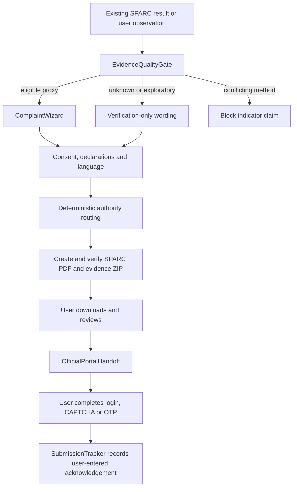

# Report Environmental Concern workflow

**Status:** P0 contract, jurisdiction packs, and browser package-creation integration
**Owner:** Codex for API/contracts; Claude for browser components after contract review

SPARC creates a reviewable evidence package and hands the user to an official
portal. It is not a government submission service and does not decide that a
law was broken.

## Flow



## Server sequence

```mermaid
sequenceDiagram
    participant U as User/browser
    participant API as SPARC API
    participant Q as EvidenceQualityGate
    participant R as Authority registry
    participant G as Report generator
    participant P as Official portal

    U->>API: POST /api/v1/reports
    API->>Q: validate evidence and claim mode
    Q-->>API: eligible, verification-only, or blocked
    opt explicit Gemini consent
        API->>G: send minimized non-identifying drafting context to Gemini
        G-->>API: neutral narrative draft
    end
    API->>API: append sensitive details locally; keep signature blank
    API->>R: rank primary and optional secondary route
    API->>G: create deterministic PDF/ZIP and manifest
    G-->>API: SHA-256 checked artifacts
    API-->>U: report ID, access token, metadata
    U->>API: GET artifact
    U->>API: POST submit-handoff (confirmed review)
    API-->>U: allowlisted HTTPS URL; no proxying
    U->>P: manually submits after portal verification
    U->>API: POST acknowledgement (user-entered reference)
```

## State model

`READY_FOR_DOWNLOAD → HANDOFF_RECORDED → ACKNOWLEDGED`.

Any state can become `EXPIRED` after the 24-hour P0 retention window. Deletion
removes the temporary record and all generated bytes. An acknowledgement is a
user statement, not an authority verification.

## Claude-owned browser interfaces

- `EvidenceQualityGate` consumes the API decision; it does not recalculate scientific quality.
- `ComplaintWizard` collects issue, location, observation, language, consent, authority, and preview confirmation.
- `OfficialPortalHandoff` opens only an HTTPS URL returned by the allowlisted registry and explains manual CAPTCHA/OTP steps.
- `SubmissionTracker` accepts a user-entered external reference and date; it never polls or scrapes a portal.

The browser must surface `meta.mock`, validation status, boundary provenance,
the non-authoritative-boundary disclaimer, and the manual-submission warning.

## Fallbacks

- Missing or low-quality evidence: verification-only language.
- Conflicting built-up methods: no built-up directional or numerical claim.
- Unknown municipal jurisdiction: require user selection before NMC routing.
- Unsupported country: preserve the report locally and expose export-only artifacts without guessing an authority.
- Recognized but unverified area: generate artifacts but show no unverified submission URL.
- City catalog entry without a validated Earth Engine pack: render report/export
  scope, send null/`NOT_RUN` evidence, and never fabricate a satellite number.
- Stale authority URL: show the source record and ask the user to verify the official site.
- Artifact failure: expose structured manifest/JSON rather than an incomplete PDF or ZIP.
